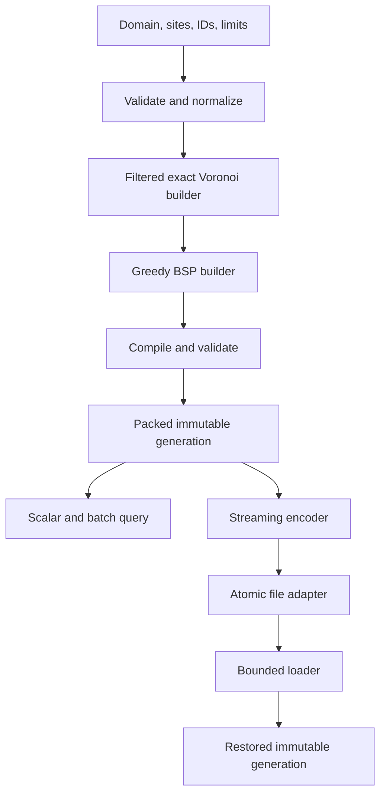
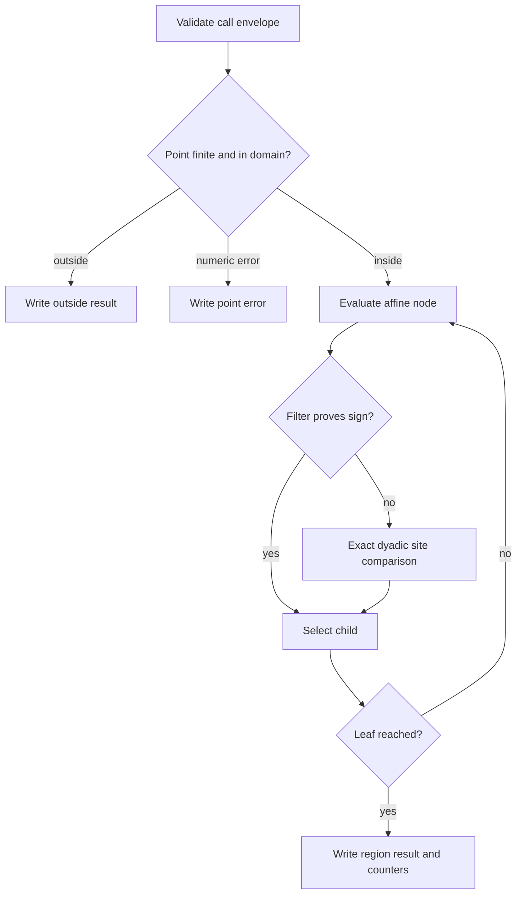
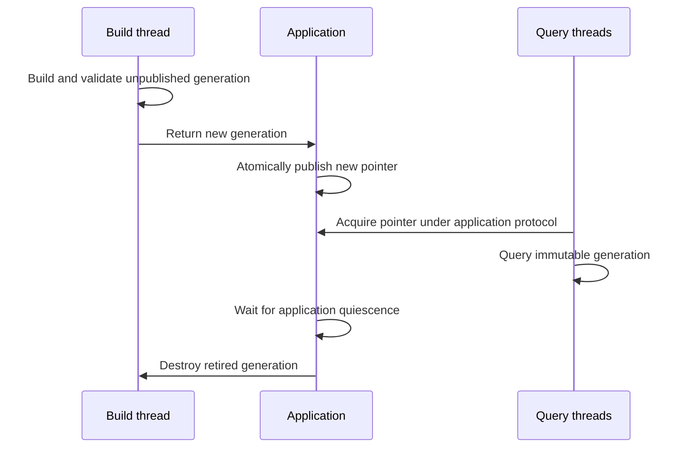
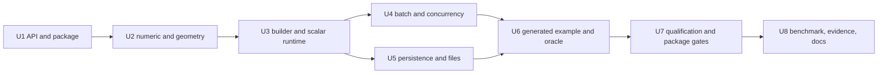

# Production Oblique Decision Tree Library - Plan

## Goal Capsule

- **Objective:** Deliver a reusable production-grade C library that turns a static two-dimensional Voronoi dataset into an immutable Oblique Decision Tree, accepts scalar or batch point queries, and returns region conclusions.
- **Product authority:** This plan owns the production library and an article-shaped generated-data example. DuckDB integration, reproduction of DuckDB's reported speedup, and generalization of the method into an agent skill are separate follow-up work.
- **Open blockers:** None. Planning may choose implementation details without changing the Product Contract.

---

## Product Contract

### Summary

Build a C library that owns the complete `data -> tree -> query -> conclusion` lifecycle for static two-dimensional Voronoi point location.
The library compiles user-provided sites and region IDs into an immutable Oblique Decision Tree, supports concurrent scalar and batch queries, and can persist and restore compiled generations.

### Problem Frame

The current study proves only a hand-authored seven-node evaluator.
It does not construct a tree from user data, own memory, package an installable API, support batch evaluation, persist compiled state, or establish concurrency, compatibility, fault, and performance boundaries.

The useful reusable mechanism is not the example tree itself.
It is the transformation of rich build-time spatial data into a validated compact runtime program whose repeated lookup cost depends on tree depth rather than the number of regions.

### Key Decisions

- **Production library first.** (session-settled: user-approved — chosen over immediate DuckDB benchmark reproduction or skill generalization: the reusable implementation must exist before integration and methodology work can be grounded.) Governs R1-R22.
- **Library-owned construction.** (session-settled: user-directed — chosen over accepting only a caller-built tree: users provide data and expect the library to build the tree and return conclusions.) Governs R1-R7, R12-R14.
- **Article-shaped Voronoi domain.** (session-settled: user-directed — chosen over supervised classification samples or a generic polygon classifier: the example and first production contract follow the article's two-dimensional point-location problem.) Governs R1-R5, R17-R19.
- **Immutable published generations.** (session-settled: user-approved — chosen over in-place region mutation: build-once/read-many data can be validated and compacted before lock-free concurrent reads.) Governs R6-R11, R15-R16.

### Requirements

**Domain and construction**

- R1. A caller supplies a finite positive rectangular domain, at least one distinct finite two-dimensional site inside that closed domain, and one caller-defined `int32` region ID per site.
- R2. The library constructs the rectangularly clipped Voronoi cells implied by the sites instead of trusting caller-supplied polygons.
- R3. Coincident sites, invalid domains, duplicate region IDs, non-finite coordinates, impossible resource limits, and unsupported numeric conditions fail before a runtime generation is published.
- R4. Points on the outer rectangle boundary are inside the domain; points outside return a distinct outside conclusion rather than a region ID.
- R5. Exact site ties use a deterministic policy defined by input order so construction, scalar query, batch query, persistence, and the independent oracle agree.
- R6. Construction selects affine half-space cuts using a deterministic balance-and-fragmentation objective and records build statistics including node count, leaf count, maximum depth, fragment count, and build duration.
- R7. Construction enforces caller-configurable hard limits for sites, polygon fragments, internal nodes, depth, build memory, and build work; limit failure leaves no partially published generation.

**Runtime, ownership, and concurrency**

- R8. Successful construction returns an opaque library-owned immutable generation with explicit destroy semantics.
- R9. A generation supports scalar and batch two-dimensional queries without allocation, mutation, hidden global state, or retained input/output pointers.
- R10. Multiple threads may query the same published generation concurrently without external locking.
- R11. Updates build a new generation and replace the application-owned generation reference only after successful construction; the library does not mutate a published generation in place.
- R12. Query output distinguishes a region result, an outside result, and an evaluation error, and reports comparison counts through optional statistics rather than overloading the region ID.
- R13. Batch evaluation defines deterministic partial-failure behavior: invalid batch arguments fail before output mutation, while per-point numeric failures are reported per point without corrupting neighboring results.
- R14. All public operations define copied, borrowed, and owned lifetimes, define which outputs are cleared or remain unchanged on each failure class, and return stable library error codes.

**Persistence and compatibility**

- R15. A compiled generation has an explicit versioned binary encoding with fixed byte order, checked lengths and offsets, checksums, and no persisted C struct layout or pointers.
- R16. Load validates the complete encoding before publication, rejects corruption and unsupported versions, and produces a generation with scalar and batch behavior identical to the source generation.
- R17. The public C API carries semantic version macros, C++ linkage guards, documented compatibility rules, install/export metadata, and an external consumer test that uses only the installed package.

**Generated example and observable learning output**

- R18. A deterministic generator creates an article-shaped dataset over a `12 x 8` rectangle with approximately 1,000 non-uniform sites, region IDs, and reproducible query-point sets; the example asks the library to construct the Voronoi cells.
- R19. The example builds the library generation from the generated sites, writes build statistics, evaluates representative and bulk points, and prints human-readable summaries plus machine-readable data.
- R20. A Python 3.13 environment managed by pyenv and uv independently computes exact nearest-site conclusions from the generated sites, reports totals and representative rows, and differentially checks the C scalar, batch, and restored-generation outputs.
- R21. The study documentation spells out Oblique Decision Tree on first use, explains the complete reduction chain, and uses fenced printable-ASCII graphs to show build, publish, query, update, and recovery flows.

**Qualification and performance evidence**

- R22. Qualification covers FIL-C first, Debug and optimized native builds, ASan/UBSan, static analysis, formatting, deterministic model-based differential tests, malformed/corrupt persisted inputs, allocator and I/O fault injection, multithreaded read tests, clean install/consumer tests, and source/binary evidence manifests.
- R23. A native benchmark compares the compiled tree against brute-force nearest-site lookup on identical generated datasets, validates every result with a checksum, reports construction cost separately from query cost, and records topology, compiler, flags, input distribution, repetitions, and available hardware counters.
- R24. No benchmark result is described as a DuckDB speedup or as reproducing the article's `59x` result; DuckDB end-to-end reproduction remains separate work.

### Actors

- A1. **Library integrator:** supplies sites and limits, owns generation publication and replacement, and consumes query conclusions.
- A2. **Build thread:** constructs or restores a complete unpublished generation.
- A3. **Query threads:** concurrently evaluate scalar or batch points against one immutable generation.
- A4. **Operator or verifier:** inspects build statistics, evidence, benchmark metadata, and failure diagnostics.

### Key Flows

- F1. **Build and publish**
  - **Trigger:** A1 provides a domain, sites, region IDs, and resource limits.
  - **Actors:** A1, A2
  - **Steps:** Validate input; derive Voronoi cells; construct and validate the decision tree; compile immutable runtime data; return an unpublished generation and build statistics; let A1 publish it.
  - **Outcome:** Query threads can use a complete generation, or construction fails without a partial generation.
  - **Covers:** R1-R8, R14.
- F2. **Scalar or batch query**
  - **Trigger:** A3 has a published generation and one or more points.
  - **Actors:** A3
  - **Steps:** Validate call arguments; traverse immutable affine nodes; write region, outside, or per-point error results; optionally update caller-owned aggregate statistics.
  - **Outcome:** Results are deterministic and concurrent reads require no generation mutation.
  - **Covers:** R4-R5, R9-R14.
- F3. **Persist and restore**
  - **Trigger:** A1 requests generation reuse across process lifetimes.
  - **Actors:** A1, A2
  - **Steps:** Encode the validated generation; store bytes through caller-owned I/O; later load and fully validate bytes into an unpublished generation; publish only after success.
  - **Outcome:** Restored queries match the source generation, or load fails without publication.
  - **Covers:** R15-R17.
- F4. **Replace a generation**
  - **Trigger:** The site's dataset changes.
  - **Actors:** A1, A2, A3
  - **Steps:** Build a new generation while readers keep the old one; atomically replace the application-owned reference; retire the old generation after the application's reader-lifetime protocol says no reader holds it.
  - **Outcome:** Readers observe one complete generation and never an in-place mutation.
  - **Covers:** R10-R11.
- F5. **Generate and verify the article-shaped example**
  - **Trigger:** A4 runs the maintained example and evidence workflow.
  - **Actors:** A4
  - **Steps:** Generate sites and queries; build and persist the generation; evaluate C scalar, batch, and restored paths; run the Python oracle; emit readable and machine-readable summaries; run the benchmark separately.
  - **Outcome:** Correctness and performance evidence are inspectable instead of hidden behind a test runner's `ok`.
  - **Covers:** R18-R24.

### Transformation and Lifecycle

```text
+-----------------------+
| Sites + Region IDs    |
| Domain + Hard Limits  |
+-----------+-----------+
            |
            v
+-----------------------+
| Validate Input        |
| Build Voronoi Cells   |
+-----------+-----------+
            |
            v
+-----------------------+
| Mutable Tree Builder  |
| Split + Clip + Score  |
+-----------+-----------+
            |
            v
+-----------------------+
| Compile + Validate    |
| Immutable Generation  |
+-----+------------+----+
      |            |
      v            v
+-----------+  +----------------+
| Query One |  | Query Batch    |
+-----+-----+  +-------+--------+
      |                |
      +--------+-------+
               v
      +----------------+
      | Region/Outside |
      | Per-Point Error|
      +----------------+

Dataset update:

old generation --readers--> retire after quiescence
new data -> build -> validate -> publish new generation

Process restart:

generation -> encode -> stored bytes -> validate/load -> generation
```

### Acceptance Examples

- AE1. **Covers R1-R6, R8, R12.** Given three sites A `(2,2)`, B `(8,3)`, and C `(4,7)` in `[0,10] x [0,8]`, when the library builds and queries the site coordinates, then it returns A, B, and C respectively, reports deterministic non-time build statistics, and records observed build duration.
- AE2. **Covers R4-R5, R12.** Given a point on the rectangle boundary, a point outside it, and a point exactly equidistant from two sites, when queried, then the boundary point returns a region, the outside point returns outside, and the tie follows input order.
- AE3. **Covers R3, R7-R8, R14.** Given coincident sites or a build whose configured fragment limit is one below required work, when construction runs, then it returns the documented error, clears the output generation, and leaks no allocation.
- AE4. **Covers R9-R10, R13.** Given one published generation and multiple threads issuing mixed scalar and batch queries, when all outputs are compared with a single-thread oracle, then every region, outside, and per-point error result agrees and the generation remains unchanged.
- AE5. **Covers R15-R16.** Given a compiled generation, when it is encoded and loaded, then source and restored scalar/batch checksums match; every nonempty truncated prefix and targeted checksum/offset corruption is rejected.
- AE6. **Covers R18-R20.** Given the deterministic approximately 1,000-site demo, when the maintained workflow runs, then the terminal shows generated counts, tree depth and size, region/outside/error totals, exact-fallback counts, mismatches, representative rows, and output artifact locations.
- AE7. **Covers R22.** Given allocator and I/O fault injection at each supported failure point, when build, encode, load, and atomic save fail, then no partial generation is published, all owned resources are released, pre-rename failures preserve the old destination, and post-rename durability uncertainty is reported distinctly for reopen-and-validate recovery.
- AE8. **Covers R23-R24.** Given identical generated inputs, when native optimized benchmark variants run, then each reports matching checksums and separate build/query measurements without claiming DuckDB equivalence.

### Success Criteria

- An external C and C++ consumer can install, link, build, persist, restore, query, and destroy the library using only installed public artifacts.
- The deterministic generated example exposes its data, build statistics, representative classifications, oracle summary, and benchmark summary to a human reader.
- Correctness gates pass across the required safety, sanitizer, model, corruption, fault, concurrency, package, and compatibility surfaces.
- Performance conclusions are limited to the recorded native environment and include construction amortization and baseline equivalence.

### Scope Boundaries

**Deferred to follow-up work**

- DuckDB extension integration and end-to-end reproduction of the article's tree, nested `CASE`, and spatial join benchmark.
- Generalization of compile-time reduction and runtime representation into a cross-domain agent skill.
- Higher-dimensional affine trees, arbitrary caller-supplied convex partitions, generic leaf payloads, and fixed-depth execution variants.

**Outside this product's identity**

- Training CART, random forests, gradient-boosted trees, or learning boundaries from labeled samples.
- In-place mutation of a published generation.
- A general-purpose dynamic spatial index for overlapping or frequently changing geometry.

### Dependencies and Assumptions

- The v1 mathematical domain is nearest-site Voronoi point location inside one finite axis-aligned rectangle.
- Region IDs are unique `int32` values and are opaque to the library.
- The application owns the atomic publication and reader-quiescence mechanism; the library owns each generation's memory and never frees it while the application still exposes it to readers.
- The current educational study and the repository's production B+ tree library are implementation evidence, not authorities that may weaken this Product Contract.

### Sources and Research

- `learning/studies/20260915-affine-decision-tree-point-location/README.md`
- `learning/studies/20260915-affine-decision-tree-point-location/source.md`
- `learning/studies/20260911-bplus-tree/README.md`
- `skills/learn.md`
- `skills/rust/compile-runtime-representation/SKILL.md`

---

## Planning Contract

Product Contract preservation: clarified, no scope change. R1 now states that sites are inside the closed domain; R14 names deterministic failure-output states; R18 assigns cell construction to the library; AE1, AE4, AE6, and AE7 use the exact runtime and persistence terminology defined by their governing requirements.

### Key Technical Decisions

- KTD1. **Use a rich geometry builder and one packed immutable generation.** (session-settled: user-approved — chosen over reusing the mutable geometry graph at query time: the build-once/read-many lifecycle needs an explicit compile boundary.) The builder owns polygons, fragments, candidate indexes, diagnostics, and temporary work arrays. Successful compile validates all references and copies only the domain, original sites, affine nodes, leaves, and immutable metadata into one aligned allocation. The generation stores a copy of the allocator table so destruction uses the same family and layout. Governs R6-R11 and follows `skills/rust/compile-runtime-representation/SKILL.md` plus `skills/c/allocator-engineering/SKILL.md`.
- KTD2. **Construct cells with filtered exact rectangular half-plane clipping.** Represent every domain edge and site-pair bisector as an exact dyadic line. Represent each polygon vertex by the pair of source lines whose intersection defines it. Binary64 filters accelerate line-side and line-intersection tests, but a fixed-limb exact determinant decides every uncertain topology result. Canonical vertex ordering and candidate IDs derive only from input ordinals. Governs R1-R7.
- KTD3. **Define all ties by exact binary64 values and input ordinal.** The winning site is the minimum lexicographic pair `(exact squared distance, input ordinal)`. Runtime nodes store defining-site ordinals and derived normalized affine coefficients. A bounded floating-point filter handles ordinary comparisons; an allocation-free fixed-limb dyadic comparator decides uncertain cases exactly from the original binary64 site and query bits. Construction, scalar query, batch query, load validation, and the Python `Fraction` oracle use this rule. Governs R3-R5, R9, R12-R13, and R16.
- KTD4. **Build a deterministic BSP from certified Voronoi boundaries.** Candidate cuts are canonical defining-site bisectors from generated Voronoi edges. At each node, minimize the tuple `(largest child region count, new fragment count, total child fragments, defining-site ordinal pair)`. A candidate is admissible only when both children are nonempty and its two defining sites land on opposite sides, which guarantees label-set progress. Every classification, clipping operation, candidate evaluation, and emitted fragment consumes caller-bounded work. Governs R6-R7.
- KTD5. **Keep query state caller-owned and make batch acceptance transactional.** Scalar and batch query paths allocate nothing and mutate no generation state. Invalid batch envelopes, count overflow, null/stride errors, and overlapping point/result ranges fail before any result changes. After envelope acceptance, every result slot is written exactly once; non-finite or unrepresentable points receive a per-point error while the batch call succeeds and aggregate statistics count attempted, region, outside, failed, comparisons, and exact fallbacks. Governs R9-R14.
- KTD6. **Use a sectioned little-endian wire format independent of C layout.** Format version 1 has a fixed header, total size, domain and build metadata, bounded section descriptors, original site bits, defining-site node records, leaves, and CRC32C. Floating filter coefficients are not persisted; load derives them from original site bits under KTD11. Load checks limits before allocation, validates all offsets and graph invariants, and publishes only after the whole generation passes. The encoder computes size and checksum in bounded passes and streams through callbacks without retaining caller buffers. Governs R15-R17.
- KTD7. **Separate persistence core from a stateful POSIX atomic-file adapter.** Core encode/load use caller-owned bounded sink and snapshot-stable random-access source callbacks. The file adapter creates a same-directory exclusive temporary file, writes and syncs it, renames it over the destination, and syncs the parent directory. Pre-rename failures preserve the old destination. A failure after rename returns stable `ODT_COMMIT_UNKNOWN` because the new file may be visible but not crash-durable; recovery reopens and validates before retry. The supported v1 file contract is local POSIX storage, not network filesystems. Governs R14-R17.
- KTD8. **Expose no publication or reclamation primitive.** The application may atomically exchange generation pointers, but it must delay `odt_generation_destroy` until its epoch, hazard-pointer, reference-count, or grace-period protocol proves that no reader retains the old pointer. Concurrent queries against one live generation are supported; concurrent destroy or query-after-destroy is invalid. Governs R8-R11 and F4.
- KTD9. **Make the example a versioned, reproducible data protocol.** The generator uses PCG32 with seed `20260916`, creates exactly 1,000 non-uniform sites in a `12 x 8` domain, assigns region IDs from input ordinals, and writes canonical binary64 hexadecimal CSV. Query output is JSON Lines and the summary is versioned JSON. Human and machine modes are separate, with exit codes `0` for verified success, `1` for a semantic mismatch, and `2` for input or execution failure. Governs R18-R20.
- KTD10. **Bind every claim to one manifest-driven evidence run.** One maintained driver runs FIL-C before native checks, then Debug, optimized, sanitizers, static analysis, independent oracle, corruption, fault, concurrency, package-consumer, and benchmark gates. It records source and binary digests, commands, environment, and raw outputs in a manifest. The benchmark reports only target-specific tree-versus-brute-force evidence and keeps build cost separate. Governs R22-R24.
- KTD11. **Make the numeric platform and acceptance envelope executable.** V1 requires 8-bit bytes, radix-2 IEEE 754 binary64 with 53 significand bits and the standard exponent range, round-to-nearest-ties-to-even, and gradual underflow. Build and query reject an unsupported active floating environment before output mutation. Fixed-limb capacities are derived from the full binary64 exponent range, so every R1 dataset inside configured resource limits has an exact predicate path; native extended precision and contraction never decide topology or a region. Governs R1-R5, R9, and R16.

### High-Level Technical Design

The library has one mutation boundary and three read-only consumption paths.



An accepted query has a fixed decision sequence.



The library's ownership boundary excludes generation publication and reclamation.



### Output Structure

```text
learning/studies/20260915-affine-decision-tree-point-location/
|-- lib/
|   |-- CMakeLists.txt
|   |-- README.md
|   |-- cmake/odtConfig.cmake.in
|   |-- include/odt.h
|   |-- src/
|   |   |-- odt.c
|   |   |-- odt_builder.c
|   |   |-- odt_crc32c.c
|   |   |-- odt_exact.c
|   |   |-- odt_file.c
|   |   |-- odt_geometry.c
|   |   |-- odt_internal.h
|   |   |-- odt_persistence.c
|   |   `-- odt_query.c
|   `-- tests/
|       |-- odt_batch_test.c
|       |-- odt_builder_test.c
|       |-- odt_concurrency_test.c
|       |-- odt_corruption_test.c
|       |-- odt_fault_test.c
|       |-- odt_geometry_test.c
|       |-- odt_persistence_test.c
|       |-- odt_query_test.c
|       |-- odt_test_support.c
|       |-- odt_test_support.h
|       |-- fixtures/
|       |   |-- format_v1_minimal.odt
|       |   |-- format_v1_representative.odt
|       |   `-- manifest.sha256
|       `-- package_consumer/
|           |-- CMakeLists.txt
|           |-- consumer.c
|           `-- consumer.cpp
|-- example/
|   |-- CMakeLists.txt
|   |-- data/
|   |   |-- queries.csv
|   |   `-- sites.csv
|   |-- python/
|   |   |-- generate_dataset.py
|   |   |-- point_location_oracle.py
|   |   |-- pyproject.toml
|   |   |-- tests/test_protocol.py
|   |   `-- uv.lock
|   `-- src/
|       |-- benchmark.c
|       `-- odt_example.c
|-- evidence/
|   |-- manifest.json
|   |-- README.md
|   `-- raw/
|-- README.md
`-- verify.sh
```

### API, Ownership, and Error Model

- Public configuration structs have a `struct_size` field and initializer functions. New minor versions may append fields while preserving existing layouts and semantics.
- `odt_generation` is opaque. The rich builder is private to the library. One public build operation sets its output generation pointer to null before work starts and returns a generation only after validation succeeds.
- The allocator table contains context, aligned allocation, and matching deallocation callbacks. The library never mixes allocator families, calls untracked `realloc`, or assumes zeroed memory.
- Borrowed build inputs and callback buffers remain caller-owned and are used only for the duration of the call. Allocator context is the exception: it remains caller-owned but must outlive every generation created with it and remain valid through destroy. The generation copies every site, region ID, node, leaf, and allocator callback it needs.
- Stable status values separate invalid arguments, invalid data, configured limits, unsupported numeric environment, allocation failure, I/O failure, commit-unknown state, corruption, unsupported format, and internal invariant failure.
- Scalar errors leave the output unchanged. Batch envelope errors leave all outputs unchanged. Accepted batches produce one explicit kind and point status per slot.
- The public header documents thread safety for each operation. Only query and metadata accessors are safe to call concurrently on the same live generation.

The normative v1 public surface is fixed before U2 begins.

| Surface | Public data and behavior |
| --- | --- |
| Initialization and diagnostics | Version macros; initializers for allocator, limits, build options, encode options, and load limits; stable status-to-string lookup. |
| Build | `odt_build` accepts domain, contiguous sites with `int32` region IDs, options, limits, allocator, optional statistics, and one generation output. |
| Query | `odt_query` accepts one point and output; `odt_query_batch` accepts count plus byte-strided point/result arrays and optional aggregate statistics. Strides are bytes and zero count follows KTD5. |
| Generation metadata | Read-only accessors return domain, site count, node count, leaf count, maximum depth, encoded size, and copied build statistics. |
| Streaming persistence | `odt_encode` writes through a sink callback; `odt_load` reads from a size-declared snapshot-stable random-access source with load limits and allocator. Callback status propagates as an I/O error without retention. |
| File persistence | `odt_save_file_atomic` and `odt_load_file` implement KTD7 and surface `ODT_COMMIT_UNKNOWN` distinctly. |
| Lifetime | `odt_generation_destroy` requires application-proven quiescence and a still-live allocator context; null is accepted as a no-op. |

### Runtime Layout and Persistence Invariants

- The packed allocation contains an internal header followed by aligned fixed-width site, node, and leaf sections. Every size and offset uses checked arithmetic before allocation.
- Runtime child references are signed 32-bit indexes. Zero is invalid, positive values address nodes, and negative values address leaves. Root and reachability invariants are checked at compile and load.
- Each runtime node stores derived normalized affine coefficients, two defining-site ordinals, deterministic tie direction, and two child references. The wire node stores only defining-site ordinals, tie direction, and children. Load rebuilds filter coefficients without changing exact region semantics.
- The file header declares counts, section offsets and lengths, encoded total size, format version, and checksum. Reserved fields must be zero. Sections are non-overlapping, naturally aligned in the wire format, and fully contained in the declared size.
- Load limits cap encoded bytes, sites, nodes, leaves, depth, and allocation before any variable-size allocation. The loader rejects trailing bytes unless a later format version explicitly defines them.
- Encoding and decoding use explicit integer and binary64 bit conversion. Neither `sizeof(struct)` nor host endianness defines the file.
- The repository retains independently encoded minimal and representative format-v1 fixtures with immutable byte digests and decoded semantic expectations. Every format-v1 encoder reproduces them and every supported decoder loads them.
- A source callback promises one stable byte snapshot for the full load call. Mutation during load is a caller contract violation; observed inconsistency still fails checksum or structural validation without publication.

### Determinism and Numeric Safety

- Site input order is the only semantic tie source. Region ID value, allocator address, hash iteration order, thread schedule, and locale do not affect construction.
- Coordinate normalization uses one positive power-of-two scale for both axes so nearest-site ordering is unchanged and affine coefficients stay bounded. If scaling loses information needed by the filter, the affected node is marked exact-only instead of rejecting an otherwise valid R1 dataset.
- The floating filter uses a documented forward-error bound for one compiler-controlled operation sequence. Values within that bound use the dyadic comparator; no heuristic ULP band may select a different region.
- Geometry topology uses exact signs over source-line intersections. Floating coordinates may accelerate bounds and diagnostics but never add, remove, order, or classify a vertex without an exact-certified sign.
- Build validation checks that every fragment is convex, every vertex satisfies its owning site's Voronoi constraints, sibling fragments cover opposite sides of the selected cut, every leaf has one region ordinal, and all references are reachable.
- An independent compile verifier reconstructs each leaf's in-domain path polygon from exact source lines. It proves the path is nonempty and that its assigned site wins lexicographically against every other site throughout the polygon. Any unproved implication rejects publication.
- Build-memory limits count requested bytes for every live library allocation plus alignment padding. Caller inputs and allocator-internal bookkeeping are outside the limit.

### Architecture Gate

U3 blocks all downstream units until the canonical 1,000-site corpus satisfies these predeclared thresholds in an optimized local build:

- maximum tree depth at most `64`;
- mean comparisons at most `32` and p99 comparisons at most `64` for non-boundary interior queries;
- at most `65,535` internal nodes and `1,000,000` live or emitted fragments;
- at most `512 MiB` peak tracked build memory;
- exact-fallback rate below `1%` for non-boundary random queries;
- zero mismatches against the exact oracle for all canonical and adversarial queries.

Failure triggers redesign of KTD4 before batch, persistence, or packaging work continues. The final target benchmark additionally requires scalar and batch median query throughput to exceed brute force by at least `2x`, with the lower bound of the measured 95% confidence interval above `1.0x`.

### Sequencing



### System-Wide Impact

- The production `lib/` is separate from the educational `demo/`. Existing demo behavior and tests remain intact.
- The root study README becomes the authority for production scope and links the educational evaluator as historical groundwork.
- Consumers gain a stable C ABI and installable CMake package. They do not inherit an application-level concurrency framework.
- Persistence introduces an on-disk compatibility obligation. Any later incompatible encoding requires a new format version and explicit migration or rejection behavior.
- Generated data and evidence become maintained study assets. Temporary binaries, installed prefixes, benchmark runs, and large transient outputs remain under `.tmp/`.

### Risks and Mitigations

| Risk | Consequence | Mitigation and stop condition |
| --- | --- | --- |
| Geometry ambiguity near degenerate sites | A tree could encode the wrong region topology | Use exact source-line topology and the independent exact leaf-path verifier; reject any unproved path implication. |
| BSP fragmentation grows faster than expected | Build time and memory exceed practical limits | Count every operation, enforce all R7 limits, expose statistics, and stop with a limit error before publication. |
| Exact fallback is incorrect or too frequent | Boundary errors or query regression | Differentially test raw binary64 edge cases against Python `Fraction`; report fallback count; treat unexpected fallback-rate growth as a benchmark regression. |
| Wire parser accepts hostile lengths or references | Allocation abuse or invalid generation publication | Check limits before allocation, use checked arithmetic, validate every section and graph invariant, and fuzz structured corruptions including checksum-valid mutations. |
| File replacement semantics differ across filesystems | Durability claims become false | Scope v1 to local POSIX filesystems, record sync failures, and avoid claims for NFS or managed object stores. |
| Application frees a generation with active readers | Use-after-free outside the query implementation | Keep reclamation outside the API, document the precondition, and provide a pthread example that waits for readers before destroy. |
| A microbenchmark overstates production value | Misleading performance conclusion | Validate checksums, separate build and query costs, record target metadata, inspect optimized code, and forbid DuckDB equivalence claims. |

### Deferred to Implementation

- The exact internal helper names and source-file split may change while preserving the public API and unit ownership.
- The target machine may deny PMU access. Record the denial and retain topology plus repeated wall-time evidence instead of substituting simulated counters.
- The fixed-limb implementation may select 64-bit or 32-bit limbs based on sanitizer and FIL-C compatibility. Its compile-time capacity proof for the full binary64 exponent range and oracle results are authoritative.

---

## Implementation Units

### U1. Establish the public API, ownership model, and package

- **Goal:** Create the installable library skeleton, stable public types, allocator contract, opaque handles, error strings, version metadata, and C/C++ package-consumer surface.
- **Requirements:** R1, R7-R9, R12-R14, R17; A1-A3; F1-F2; KTD1, KTD5, KTD8.
- **Dependencies:** None.
- **Files:** `learning/studies/20260915-affine-decision-tree-point-location/lib/CMakeLists.txt`, `learning/studies/20260915-affine-decision-tree-point-location/lib/cmake/odtConfig.cmake.in`, `learning/studies/20260915-affine-decision-tree-point-location/lib/include/odt.h`, `learning/studies/20260915-affine-decision-tree-point-location/lib/src/odt.c`, `learning/studies/20260915-affine-decision-tree-point-location/lib/src/odt_internal.h`, `learning/studies/20260915-affine-decision-tree-point-location/lib/tests/odt_test_support.h`, `learning/studies/20260915-affine-decision-tree-point-location/lib/tests/odt_test_support.c`, `learning/studies/20260915-affine-decision-tree-point-location/lib/tests/package_consumer/CMakeLists.txt`, `learning/studies/20260915-affine-decision-tree-point-location/lib/tests/package_consumer/consumer.c`, `learning/studies/20260915-affine-decision-tree-point-location/lib/tests/package_consumer/consumer.cpp`.
- **Approach:**
  1. Define versioned configuration structs with initializers and stable status/result enums.
  2. Define aligned allocator callbacks, the context-through-destroy lifetime, and default allocator behavior without hidden global mutation.
  3. Add opaque build/query/persistence declarations with precise copied, borrowed, and owned lifetimes.
  4. Mirror the repository B+ tree's export, install, C++ linkage, and clean consumer patterns.
- **Execution note:** Start with compile-only C and C++ consumers plus allocator ownership tests before implementing the bodies.
- **Patterns to follow:** `learning/studies/20260911-bplus-tree/lib/include/rbt.h`, `learning/studies/20260911-bplus-tree/lib/CMakeLists.txt`, `learning/studies/20260911-bplus-tree/lib/tests/package_consumer/`.
- **Test scenarios:**
  - Default initializers set supported `struct_size`, conservative limits, and a usable allocator.
  - Null pointers, undersized public structs, invalid alignment, and unsupported version fields return stable errors without mutating outputs.
  - A counting allocator observes matched allocate/free family and exact layout on every completed operation.
  - A poisoned allocator-context test proves the context remains live through generation destroy and is never accessed afterward.
  - Installed C and C++ consumers include only `odt.h`, link through `find_package(odt CONFIG REQUIRED)`, and run without source-tree include paths.
- **Verification:** Public declarations compile as C11 and C++17 with warnings as errors; ABI/version tests pass; install and consumer smoke tests resolve the exported target.

### U2. Implement exact predicates and certified Voronoi geometry

- **Goal:** Validate and normalize user sites, compute rectangularly clipped Voronoi cells, and expose deterministic certified builder geometry.
- **Requirements:** R1-R5, R7, R14; F1; AE1-AE3; KTD2-KTD3.
- **Dependencies:** U1.
- **Files:** `learning/studies/20260915-affine-decision-tree-point-location/lib/src/odt_exact.c`, `learning/studies/20260915-affine-decision-tree-point-location/lib/src/odt_geometry.c`, `learning/studies/20260915-affine-decision-tree-point-location/lib/src/odt_internal.h`, `learning/studies/20260915-affine-decision-tree-point-location/lib/tests/odt_geometry_test.c`, `learning/studies/20260915-affine-decision-tree-point-location/lib/tests/odt_builder_test.c`.
- **Approach:**
  1. Decode binary64 values into sign, significand, and exponent for fixed-limb exact squared-distance, line-side, and line-intersection comparison.
  2. Add the bounded floating filter and prove fallback agreement against exact comparison.
  3. Enforce KTD11 and normalize filters with a common power-of-two scale while retaining exact original values.
  4. Clip each rectangle against canonical site-pair half-planes represented by source-line intersections while enforcing work/memory limits.
  5. Certify convexity, positive area, ownership constraints, canonical ordering, and adjacency candidates.
- **Execution note:** Build the independent exact-predicate tests before relying on predicates in clipping.
- **Patterns to follow:** `learning/studies/20260915-affine-decision-tree-point-location/demo/python/point_location_oracle.py` for exact binary64 semantics and `learning/studies/20260911-bplus-tree/lib/tests/rbt_overflow_test.c` for checked-boundary tests.
- **Test scenarios:**
  - Covers AE1. The three-site reference produces three positive convex cells whose site points classify to their own regions.
  - Covers AE2. Exact equal-distance binary64 points choose the lower input ordinal, including negative zero and subnormal coordinates.
  - Covers AE3. Coincident sites, sites outside the domain, duplicate region IDs, inverted or non-finite domains, unsupported floating environments, and a one-step-too-small work limit fail without a generation.
  - Decimal, extreme-exponent, cancellation, and random raw-bit comparisons match a separately generated Python `Fraction` corpus.
  - One-site, collinear-site, near-coincident, boundary-touching, subnormal, and highly skewed valid domains produce certified cells under KTD11.
  - Fail-after-N allocation at each geometry allocation releases all prior allocations and succeeds on retry.
- **Verification:** FIL-C executes the geometry and predicate corpus first; native Debug and sanitizer runs match the independent exact corpus and leak checks.

### U3. Build and execute the immutable decision tree

- **Goal:** Turn certified cell fragments into a deterministic bounded BSP, compile one packed generation, and implement allocation-free scalar lookup.
- **Requirements:** R6-R12, R14; F1-F2; AE1-AE3; KTD1, KTD3-KTD4.
- **Dependencies:** U2.
- **Files:** `learning/studies/20260915-affine-decision-tree-point-location/lib/src/odt_builder.c`, `learning/studies/20260915-affine-decision-tree-point-location/lib/src/odt_query.c`, `learning/studies/20260915-affine-decision-tree-point-location/lib/src/odt_internal.h`, `learning/studies/20260915-affine-decision-tree-point-location/lib/tests/odt_builder_test.c`, `learning/studies/20260915-affine-decision-tree-point-location/lib/tests/odt_query_test.c`.
- **Approach:**
  1. Evaluate canonical edge candidates with the KTD4 objective and checked work accounting.
  2. Split and clip fragments until each leaf has one site ordinal or a configured limit stops construction.
  3. Validate progress, reachability, depth, fragment ownership, and deterministic statistics.
  4. Prove every leaf path with the independent exact verifier before publication.
  5. Compile exact-size aligned site, node, and leaf sections into one generation allocation.
  6. Query the domain and affine nodes with KTD3 filtering and exact fallback.
- **Execution note:** Preserve a slow builder-owned evaluator until packed scalar results match it across generated and adversarial corpora.
- **Patterns to follow:** `learning/studies/20260915-affine-decision-tree-point-location/demo/src/odt.c` for reference traversal semantics and `skills/rust/compile-runtime-representation/SKILL.md` for the compile boundary.
- **Test scenarios:**
  - Covers AE1. Reference sites return their own region IDs and stable node, leaf, depth, fragment, work, allocation, and duration fields.
  - Covers AE2. Rectangle edges are inside, points one representable step outside are outside, and exact bisector ties follow ordinal order.
  - Repeated builds from byte-identical input produce identical nodes, leaves, and non-time statistics under different allocator addresses.
  - Each configured site, node, depth, fragment, work, and memory limit fails at the first exceeding operation without publishing a partial generation.
  - Packed lookup matches the slow builder evaluator and brute-force exact oracle on random points, every generated cell vertex, and points on both adjacent representable sides of each selected bisector.
  - Scalar invalid arguments and non-finite points leave the result object byte-for-byte unchanged.
- **Verification:** The scalar differential corpus has zero mismatches; allocation counters prove no query allocations; compiled section sizes and offsets pass overflow and alignment checks; every Architecture Gate threshold passes before U4 or U5 starts.

### U4. Add transactional batch queries and concurrent-read proof

- **Goal:** Add strided batch evaluation, per-point failures, aggregate statistics, overlap rejection, and pthread validation of immutable concurrent reads.
- **Requirements:** R9-R14; F2, F4; AE4; KTD5, KTD8.
- **Dependencies:** U3.
- **Files:** `learning/studies/20260915-affine-decision-tree-point-location/lib/src/odt_query.c`, `learning/studies/20260915-affine-decision-tree-point-location/lib/tests/odt_batch_test.c`, `learning/studies/20260915-affine-decision-tree-point-location/lib/tests/odt_concurrency_test.c`.
- **Approach:**
  1. Validate count, strides, address arithmetic, pointer ranges, and overlap before the first output write.
  2. Reuse one internal scalar evaluator and write each accepted output exactly once.
  3. Keep aggregate counters caller-owned and include exact-fallback counts.
  4. Exercise one live generation from many threads while an application-owned replacement harness publishes a new generation and retires the old only after reader join.
- **Patterns to follow:** KTD5 for transaction semantics and KTD8 for the publication boundary.
- **Test scenarios:**
  - Covers AE4. Scalar and batch outputs and comparison counts match for contiguous and padded-stride inputs.
  - Null pointers, undersized strides, count multiplication overflow, and any point/result overlap leave outputs and aggregate statistics unchanged.
  - An accepted mixed batch writes region, outside, and non-finite point errors to their exact slots and returns overall success with correct totals.
  - Zero-count batches accept documented null buffers and produce zero aggregate counters.
  - At least eight pthread readers repeat scalar and batch checksums while generations remain live; ThreadSanitizer runs when supported.
  - The replacement harness never destroys the old generation before readers leave, and post-quiescence allocator counts return to zero.
- **Verification:** Batch differential checksums equal scalar checksums; concurrency repetitions are deterministic; no query path calls allocation or writes generation bytes.

### U5. Implement streaming persistence and atomic file storage

- **Goal:** Encode, load, validate, atomically save, and restore generations through bounded callbacks and the POSIX file adapter.
- **Requirements:** R14-R17; F3; AE5, AE7; KTD6-KTD7.
- **Dependencies:** U3.
- **Files:** `learning/studies/20260915-affine-decision-tree-point-location/lib/src/odt_crc32c.c`, `learning/studies/20260915-affine-decision-tree-point-location/lib/src/odt_persistence.c`, `learning/studies/20260915-affine-decision-tree-point-location/lib/src/odt_file.c`, `learning/studies/20260915-affine-decision-tree-point-location/lib/src/odt_internal.h`, `learning/studies/20260915-affine-decision-tree-point-location/lib/tests/odt_persistence_test.c`, `learning/studies/20260915-affine-decision-tree-point-location/lib/tests/odt_corruption_test.c`, `learning/studies/20260915-affine-decision-tree-point-location/lib/tests/odt_fault_test.c`, `learning/studies/20260915-affine-decision-tree-point-location/lib/tests/fixtures/format_v1_minimal.odt`, `learning/studies/20260915-affine-decision-tree-point-location/lib/tests/fixtures/format_v1_representative.odt`, `learning/studies/20260915-affine-decision-tree-point-location/lib/tests/fixtures/manifest.sha256`.
- **Approach:**
  1. Define format-v1 field offsets and explicit little-endian codecs independently of C structs.
  2. Compute encoded size and CRC32C in bounded passes, then stream immutable sections to the sink.
  3. Validate source snapshot size, limits, descriptors, checksum, counts, references, and sites before publication, then derive runtime filters under KTD11.
  4. Add independently encoded frozen v1 fixtures and require byte-for-byte encoder plus semantic decoder compatibility.
  5. Add the same-directory temporary-file, sync, rename, directory-sync, and commit-unknown recovery state machine with injectable syscall wrappers.
- **Execution note:** Write an independent test encoder/mutator that does not call production serialization helpers.
- **Patterns to follow:** `learning/studies/20260911-bplus-tree/lib/src/rbt_crc32c.c`, `learning/studies/20260911-bplus-tree/lib/src/rbt_storage_file.c`, and `learning/studies/20260911-bplus-tree/lib/tests/rbt_corruption_test.c`.
- **Test scenarios:**
  - Covers AE5. In-memory and file round trips preserve metadata plus scalar and batch checksums.
  - Every nonempty truncated prefix, appended byte, bad magic/version/reserved field, overlapping section, count/size overflow, invalid child, unreachable node, duplicate region, and recomputed-coefficient mismatch is rejected.
  - Checksum-valid structural corruptions created by the independent mutator still fail structural validation.
  - Repeated byte-identical builds encode byte-identically under different allocator addresses, and both frozen v1 fixtures retain their declared digests and decoded semantics.
  - Covers AE7. Fail-after-N allocator, short read/write, interrupted call, sync failure, rename failure, and directory-sync failure publish no generation and leave no owned temporary file.
  - Destination replacement is atomic for successful local POSIX writes; pre-rename failure preserves the prior file; post-rename sync failure returns `ODT_COMMIT_UNKNOWN` and reopen identifies the valid old or new generation.
  - Callbacks that reenter unrelated library metadata functions do not observe hidden global state or retained buffers.
- **Verification:** The complete corruption matrix and I/O fault matrix pass under FIL-C where supported and under native sanitizers; source and restored output digests match.

### U6. Generate the article-shaped dataset and independent visible oracle

- **Goal:** Produce canonical 1,000-site data, run the C example through build/query/persist/restore, and emit readable plus machine-checkable conclusions independently verified by Python.
- **Requirements:** R18-R21; F5; AE6; KTD9.
- **Dependencies:** U4, U5.
- **Files:** `learning/studies/20260915-affine-decision-tree-point-location/example/CMakeLists.txt`, `learning/studies/20260915-affine-decision-tree-point-location/example/src/odt_example.c`, `learning/studies/20260915-affine-decision-tree-point-location/example/python/generate_dataset.py`, `learning/studies/20260915-affine-decision-tree-point-location/example/python/point_location_oracle.py`, `learning/studies/20260915-affine-decision-tree-point-location/example/python/pyproject.toml`, `learning/studies/20260915-affine-decision-tree-point-location/example/python/uv.lock`, `learning/studies/20260915-affine-decision-tree-point-location/example/python/tests/test_protocol.py`, `learning/studies/20260915-affine-decision-tree-point-location/example/data/sites.csv`, `learning/studies/20260915-affine-decision-tree-point-location/example/data/queries.csv`.
- **Approach:**
  1. Implement PCG32 directly in Python and emit exact hexadecimal binary64 fields plus stable headers.
  2. Generate clustered and background sites without duplicates and include random, boundary, site, bisector, outside, and non-finite query classes.
  3. Make the C executable parse canonical CSV, call only public library APIs, save and restore one generation, and write JSONL results plus versioned JSON summary.
  4. Make Python derive exact nearest-site winners with `Fraction.from_float`, parse all C outputs, print representative rows and totals, and fail on any scalar, batch, or restored mismatch.
- **Execution note:** Keep Python independent of tree nodes, affine coefficients, leaf arrays, and production CRC helpers.
- **Patterns to follow:** `learning/studies/20260915-affine-decision-tree-point-location/demo/python/point_location_oracle.py` and its protocol tests.
- **Test scenarios:**
  - Covers AE6. Seed `20260916` always creates exactly 1,000 unique sites inside `12 x 8` and byte-identical CSV digests.
  - Generated query classes include all four rectangle edges, representable just-outside points, every site, selected exact bisectors, random interior points, and explicit numeric-error rows.
  - Human mode prints counts, tree statistics, result totals, representative rows, and artifact paths without machine-protocol noise.
  - Machine mode emits schema-versioned JSONL and JSON with stable field names and exit codes `0`, `1`, and `2` under success, induced mismatch, and malformed input.
  - Python exact results match C scalar, batch, and restored outputs for every generated query.
- **Verification:** The committed CSV files regenerate byte-for-byte; Python protocol tests pass under the pinned uv environment; the terminal report exposes zero mismatches and nonempty representative output.

### U7. Add fault, safety, static, and package qualification gates

- **Goal:** Turn focused tests into one reproducible qualification workflow with memory, fault, corruption, concurrency, compatibility, and package evidence.
- **Requirements:** R17, R22; AE3-AE7; KTD10.
- **Dependencies:** U6.
- **Files:** `learning/studies/20260915-affine-decision-tree-point-location/verify.sh`, `learning/studies/20260915-affine-decision-tree-point-location/lib/CMakeLists.txt`, `learning/studies/20260915-affine-decision-tree-point-location/lib/tests/odt_fault_test.c`, `learning/studies/20260915-affine-decision-tree-point-location/lib/tests/odt_corruption_test.c`, `learning/studies/20260915-affine-decision-tree-point-location/lib/tests/odt_concurrency_test.c`, `learning/studies/20260915-affine-decision-tree-point-location/evidence/manifest.json`, `learning/studies/20260915-affine-decision-tree-point-location/evidence/raw/`.
- **Approach:**
  1. Make the driver fail closed when repository-local FIL-C is unavailable and run its supported core paths before any native compiler.
  2. Add Debug, optimized, fixed Zig sanitizer, static-analysis, format, deterministic oracle, corruption, fail-after-N, pthread, clean-install, C consumer, and C++ consumer stages.
  3. Verify each test stage against a named expected count and store command, tool version, source digest, binary digest, result, and limitation in the manifest.
  4. Keep generated build trees, installs, and large or transient logs under `.tmp/`; promote concise summaries, the manifest, and manifest-referenced curated records under `evidence/raw/`.
- **Patterns to follow:** `learning/studies/20260911-bplus-tree/lib/` qualification tests and repository C toolchain rules in `AGENTS.md`.
- **Test scenarios:**
  - The driver refuses to start native checks when FIL-C binaries are absent or its first-stage tests fail.
  - Every tracked test executable is represented in the manifest and every expected-count mismatch fails the run.
  - ASan/UBSan, static analysis, formatting, and package consumers can each be deliberately broken by a controlled negative probe that the gate catches.
  - All allocator and I/O failpoints are reached at least once, release all owned resources, and succeed when the fault is removed.
  - A clean install prefix contains only declared headers, library artifacts, and CMake package files.
- **Verification:** One clean driver run reports all mandatory stages passed, no untracked generated artifact enters the source tree, and manifest digests verify independently.

### U8. Benchmark, document, and publish the evidence ledger

- **Goal:** Measure build and query behavior against brute force on a target machine, document supported boundaries and operations, and finalize the evidence ledger.
- **Requirements:** R21-R24; A4; F5; AE8; KTD10.
- **Dependencies:** U7.
- **Files:** `learning/studies/20260915-affine-decision-tree-point-location/example/src/benchmark.c`, `learning/studies/20260915-affine-decision-tree-point-location/example/CMakeLists.txt`, `learning/studies/20260915-affine-decision-tree-point-location/verify.sh`, `learning/studies/20260915-affine-decision-tree-point-location/README.md`, `learning/studies/20260915-affine-decision-tree-point-location/lib/README.md`, `learning/studies/20260915-affine-decision-tree-point-location/evidence/README.md`, `learning/studies/20260915-affine-decision-tree-point-location/evidence/manifest.json`, `learning/studies/20260915-affine-decision-tree-point-location/evidence/raw/`.
- **Approach:**
  1. Benchmark construction, scalar latency, scalar throughput, batch throughput, restored generation, and exact brute force on identical inputs.
  2. Register the benchmark in CMake and the maintained driver, use warmup plus repeated measured runs, consume every output in an observable checksum, and include a negative DCE probe plus final-binary disassembly inspection.
  3. Record CPU/NUMA topology, frequency policy, compiler and flags, source/binary/data digests, repetitions, wall time, and available hardware counters.
  4. Explain the reduction chain, API lifecycle, limits, recovery, durability, tie semantics, concurrency responsibilities, generated-data protocol, and evidence boundaries.
- **Patterns to follow:** The benchmark and evidence conventions in `AGENTS.md` and `learning/studies/20260910-stackful-coroutine/evidence/`.
- **Test scenarios:**
  - Covers AE8. Every benchmark path produces the same classification checksum before timings are accepted.
  - Build time and peak temporary memory are reported separately from repeated query measurements.
  - The benchmark fails when the observable sink is removed or one implementation is deliberately made semantically incorrect.
  - Source and restored generation measurements use the same query order and report exact-fallback counts.
  - PMU denial is recorded as a limitation; no VM, simulator, or instrumented FIL-C timing substitutes for native target performance.
  - Documentation examples compile against installed artifacts and make no DuckDB or `59x` equivalence claim.
- **Verification:** The evidence ledger links every R22-R24 claim to a revision, command, environment, digest, and raw record; README examples and manifests are internally consistent.

---

## Verification Contract

Verification is fail-closed and runs in this order.

| Gate | Applies to | Required outcome |
| --- | --- | --- |
| FIL-C core correctness | U2-U5, U7 | Repository-local `filcc` and `filrun` compile and execute supported predicate, geometry, builder, query, persistence, corruption, and fault paths before native builds. |
| Native Debug | U1-U8 | CMake/Ninja build with warnings as errors; every registered CTest passes. |
| Optimized native | U3-U8 | Release build passes the same semantic checks with assertions that protect observable results still enabled. |
| Zig sanitizers | U2-U7 | Fixed Zig version and digest are recorded; ASan/UBSan runs all supported tests without findings. |
| Static and format | U1-U8 | Fixed analyzer/compiler versions produce no accepted warning; formatter check has no diff. |
| Exact differential | U2-U6 | Python 3.13.12 `Fraction` oracle reports zero mismatches for scalar, batch, and restored paths. |
| Corruption and fault | U2, U3, U5, U7 | Every enumerated allocation and I/O failpoint plus all truncated and structural corruptions are exercised and rejected without leaks or partial publication. |
| Concurrency | U4, U7 | Repeated pthread read workloads match single-thread checksums; race detector runs when the target toolchain supports it. |
| Install and consumer | U1, U5, U7 | Clean prefix works for C and C++ consumers using only exported package metadata. |
| Generated protocol | U6 | Dataset digests are reproducible; human report is visible; JSONL and JSON schemas pass protocol tests. |
| Target benchmark | U8 | Native target compiler uses at least `-O3 -march=native -mtune=native -DNDEBUG`; all variants match checksums, satisfy the Architecture Gate throughput threshold, and record required metadata. |
| Evidence manifest | U7-U8 | Every tracked source and produced evidence record has a verified digest and expected gate count. |

The benchmark first attempts the named target `fdbd:dc02:e:137::47` through the repository's normal permission and jump-host workflow. Lack of access, stable frequency control, or PMU permission is an explicit evidence limitation, not permission to fabricate or substitute results.

---

## Definition of Done

- U1-U8 are implemented in dependency order and each unit's focused tests pass before its canonical commit.
- Every R1-R24, F1-F5, and AE1-AE8 is implemented, verified, or explicitly bounded by the Product Contract without silent weakening.
- FIL-C runs before native C evidence and no host compiler is presented as FIL-C correctness evidence.
- The public API is installable, documented, C11/C++17 consumable, and free of source-tree-only dependencies.
- The library accepts user sites, builds certified cells and a bounded immutable tree, answers scalar and batch queries, persists and restores generations, and releases every owned resource.
- Exact tie behavior matches the independent Python oracle for all maintained corpora; no heuristic uncertainty allowance remains.
- The canonical 1,000-site dataset exists, regenerates byte-for-byte, and produces visible human output plus versioned machine output with zero differential mismatches.
- Fault, corruption, limit, overflow, package, and concurrent-read gates pass with expected test counts.
- Native benchmark variants match checksums and report build, memory, query, compiler, topology, repetition, digest, and available-counter evidence without DuckDB-equivalence claims.
- README, library guide, evidence ledger, and manifest describe only guarantees supported by recorded evidence.
- Experimental or abandoned implementations, stale generated artifacts, temporary installs, and unreferenced evidence files are removed before completion.
