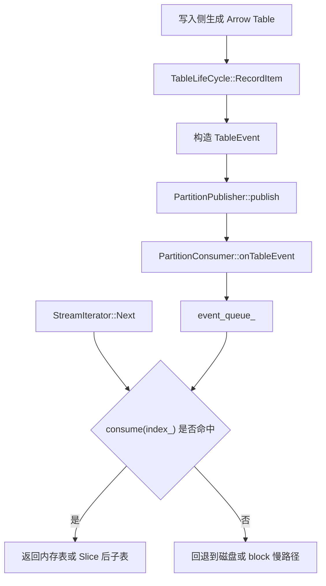
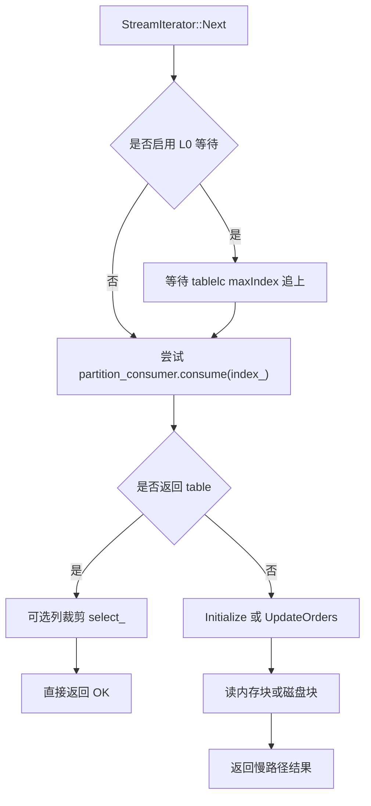
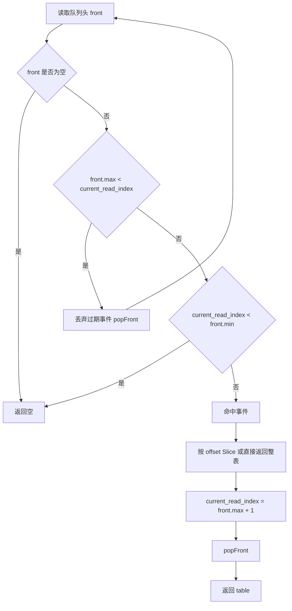

# PartitionConsumer 设计梳理

> 历史说明
>
> 这份文档保留为历史梳理入口。
>
> 自 `TableEventListener`、`PartitionPublisher`、`PartitionTableEventConsumer` 与
> `StreamIterator` 的完整链路说明补齐后，主文档已迁移到：
>
> - `docs/stream/table-event-listener.design.md`
>
> 新文档吸收了本文件中的核心内容，并按当前代码实现修正了若干历史偏差，
> 包括默认 queue 实现、事件队列容量默认值以及 `StreamIterator` 的注册/注销逻辑。

## 文档信息

| 字段 | 内容 |
| --- | --- |
| Topic | `partition-consumer` |
| Kind | `design` |
| Status | `draft` |
| 推荐命名规则 | `<topic>.<kind>.md` |
| 当前文件名 | `partition-consumer.design.md` |

建议后续 `doc-first` 协作统一使用以下命名：

- `partition-consumer.design.md`: 现状设计 / 代码梳理
- `partition-consumer.proposal.md`: 需求方案 / 改造提案
- `partition-consumer.testplan.md`: 测试方案
- `partition-consumer.review.md`: 评审结论

## 一页总结

| 项 | 说明 |
| --- | --- |
| 类定位 | `StreamIterator` 的 L0 内存快路径消费者 |
| 上游 | `TableLifeCycle` / `PartitionPublisher` |
| 下游 | `StreamIterator::Next()` |
| 输入 | `TableEvent { table, min, max }` |
| 输出 | 命中的 `arrow::Table` 或切片后的子表 |
| 核心价值 | 尽量直接消费刚写入内存的数据，减少磁盘慢路径 |
| 失效方式 | 队列未命中时自然回退到常规 block 扫描 |
| 并发模型 | 单生产者、单消费者 |

## 角色关系图



## 主流程图



## consume 决策图



## 核心职责

`PartitionConsumer` 只做 4 件事：

1. 订阅某个 partition 的 `TableEvent`
2. 将事件写入本地有界最新窗口队列
3. 在读取时按当前 `index_` 判断是否能直接命中
4. 命中则返回表，未命中则让 `StreamIterator` 回退慢路径

它不负责：

- 表生成
- block 元数据维护
- 磁盘读取
- 列投影最终收尾

## 关键对象

| 对象 | 作用 |
| --- | --- |
| `TableEvent` | 封装一张表及其索引范围 `[min, max]` |
| `PartitionPublisher` | 按 partition 分发事件 |
| `TableEventListener::create()` | 工厂导出具体 listener 实现 |
| `PartitionConsumer` | 为单个 `StreamIterator` 提供消费能力与 queue 语义 |
| `StreamIterator` | 真正对外提供流式读取 |

`TableEvent` 结构：

```cpp
struct TableEvent {
  std::shared_ptr<arrow::Table> table;
  index_t min;
  index_t max;
};
```

## 生命周期

### 创建

- `StreamIterator` 构造时创建 `PartitionConsumer`
- 容量来自 `FRINGEDB_STREAM_EVENT_QUEUE_MAX`
- `Make()` 中会补充 `description_` 供日志使用

### 注册

- `StreamIterator::Make()` 中调用 `registerL0ConsumerIfNeed()`
- 如果消费者与 partition 最新索引的 lag 不大，则注册到 `TableLifeCycle`
- 注册动作包括：
  - `registerMetrics`
  - `subscribePartition`
  - 记录 `subscribed_to_`

### 动态注销

- 当 `ENABLE_L0_DYNAMIC` 打开后，`Next()` 慢路径前会尝试动态注销 / 重注册
- 当 lag 超过 `TABLELC_MAX_GAP` 时：
  - 取消订阅
  - 清空事件队列
  - 放弃 L0 快路径

### 析构

- `StreamIterator` 析构时取消订阅并注销 metrics

## 关键数据结构

| 字段 | 含义 | 备注 |
| --- | --- | --- |
| `queue_impl_` | 当前实现类型 | 默认 `WeakSpscQueue`，可切到 `DequeLatestWindowQueue` |
| `weak_queue_` / `deque_queue_` | 两种具体实现 | 二选一生效，不再通过内部虚接口分发 |
| `event_max_index_` | producer watermark | 只在 `onTableEvent()` 更新，不随消费/清理回退 |
| `description_` | listener 描述 | 用于日志 |

## 行为规则

### `onTableEvent()`

当前实现顺序：

1. `event_max_index_ = event.max`（producer watermark）
2. 将事件交给 `queue_` 入队（与实现相关）

实际语义：

- 默认实现（Plan B）：`WeakSpscQueue`
  - 仍使用 SPSC 无锁队列
  - 队列内只保存 `weak_ptr<table>`，避免 lagging consumer 强引用历史 table
  - 队列满时 `write()` 可能失败，语义与历史一致：丢 newest
- 可选实现：`DequeLatestWindowQueue`
  - 有界 latest-window：队列满时淘汰 oldest，再保留 newest
  - 用于对照/调试/特定场景
- 实现选择：环境变量 `FRINGEDB_STREAM_PARTITION_CONSUMER_QUEUE_IMPL=deque` 切到 deque；默认不设即 weak

### `consume()`

命中规则：

- 队列空：返回空
- `front.max < current_read_index`：丢弃过期事件，继续扫描
- `current_read_index < front.min`：直接返回空
- `front.min <= current_read_index <= front.max`：命中

命中后行为：

- `offset == 0`：直接返回原表
- `offset > 0`：返回 `table->Slice(offset)`
- 推进 `current_read_index = front.max + 1`
- 弹出当前事件

## 配置项

| 配置 | 作用 | 默认 |
| --- | --- | --- |
| `FRINGEDB_STREAM_EVENT_QUEUE_MAX` | 事件队列容量 | 实现值 `1024` |
| `TABLELC_MAX_GAP` | L0 注册 / 注销 lag 阈值 | `10'000'000` |
| `ENABLE_L0_DYNAMIC` | 是否动态注销 / 重注册 L0 consumer | 关闭 |
| `ENABLE_L0_CONSUMER_WAIT` | 是否在 `Next()` 前等待 L0 追平 | 关闭 |
| `L0_WAITING_INTERVAL_MS` | L0 等待间隔 | `50ms` |

注意：

- 代码注释里写 `event_queue` 默认值是 `8192`
- 实际常量是 `1024`
- 后续如果要做功能改造，建议先统一注释与实现

## 与慢路径的关系

`PartitionConsumer` 不是唯一数据源，而是一个 fast-path。

未命中的典型场景：

- 还没订阅到 L0
- 队列为空
- 队列里都是过期事件
- 当前读位置早于队列头事件
- 队列满导致部分事件未成功入队
- 消费者落后太多，被动态注销

未命中后统一回退到：

- `Initialize()`
- `UpdateOrders()`
- 读内存 block / 磁盘 block
- index mismatch 处理逻辑

## 当前实现的已知注意点

| 主题 | 说明 |
| --- | --- |
| 队列满行为 | 当前是“尝试写入，失败即丢”，没有显式观测 |
| 水位语义 | `event_max_index_` 不等于“队列内可消费上界” |
| 顺序假设 | 依赖事件按 `min` 非递减到达 |
| 并发假设 | 依赖单生产者 / 单消费者 |
| 冗余接口 | `releaseHalfIfFull()` 当前未接入主流程 |

## 单元测试设计

### 测试目标

优先把 `PartitionConsumer` 当成一个独立可测类，验证：

- 入队后的消费命中逻辑
- 索引推进逻辑
- 过期事件清理逻辑
- 队列未命中时的返回语义
- 队列满时的真实行为
- 辅助清理接口行为

### 测试层次

| 层次 | 目标 | 建议 |
| --- | --- | --- |
| Unit | 只测 `PartitionConsumer` 纯行为 | 首选 |
| Small Integration | 联动 `TableLifeCycle` / `PartitionPublisher` 验证发布订阅链路 | 作为补充 |

### 已新增测试文件

- `test/partition_consumer_ut.cc`

### 已新增测试目标

- `cc_test(name="partition_consumer_ut", ...)`

可直接复用现有风格：

- 测试文件放在 `test/`
- target 名使用 `_ut`
- 依赖 `:fringedb` 和 `gtest`

### 为什么这个类适合单测

原因比较好：

- 公共接口简单：`onTableEvent()`、`consume()`、`releaseAllTableEvent()`、`releaseHalfIfFull()`
- 不要求真正打开 DB
- 核心依赖只是一张 `arrow::Table`
- 不必先跑完整写入 / 读取链路

### 用例矩阵

| 用例名 | 状态 | 输入 | 预期 |
| --- | --- | --- | --- |
| `consume_hit_full_table` | 已实现 | `current_read_index == min` | 返回整表，索引推进到 `max + 1` |
| `consume_hit_slice` | 已实现 | `min < current_read_index <= max` | 返回 Slice 后子表，索引推进到 `max + 1` |
| `consume_drop_obsolete_front` | 已实现 | 队列头 `max < current_read_index` | 旧事件被丢弃，继续匹配后续事件 |
| `consume_stop_when_front_is_future` | 已实现 | `current_read_index < front.min` | 返回空，不应弹出该事件 |
| `consume_empty_queue` | 已覆盖 | 通过清空队列后消费 | 返回空 |
| `release_all_table_event` | 已实现 | 队列有多个事件 | 清空后无法再命中 |
| `event_max_index_updates_even_if_queue_full` | 已实现 | 容量很小并制造写满 | `event_max_index_` 更新，但新事件可能未入队 |
| `release_half_if_full` | 待补充 | 队列填满 | 队列被裁到一半左右 |

### 推荐补一个小型集成测试

如果要验证“发布订阅链路”而不是只测本类，可增加：

- 构造 `TableLifeCycle`
- 创建 `PartitionConsumer`
- 调用 `subscribePartition`
- 通过 `RecordItem()` 发布事件
- 再用 `consume()` 读取

这个测试能覆盖：

- `TableLifeCycle::RecordItem()`
- `PartitionPublisher::publish()`
- `PartitionConsumer::onTableEvent()`

### 测试数据构造建议

推荐在测试里放一个极小 helper，生成带索引列的 `arrow::Table`：

```cpp
std::shared_ptr<arrow::Table> MakeIndexTable(
    uint64_t begin, uint64_t rows);
```

该 helper 只需要：

- 构造 `kRIndexPosition` 对应列
- 行数可控
- 索引连续

这样每个测试都能明确表达：

- 事件覆盖范围
- 当前读索引
- 期望返回多少行
- 期望推进到哪个下一个索引

### 测试边界建议

以下点值得单独断言：

- `consume()` 命中后会 `popFront()`，同一事件不会被重复消费
- `current_read_index < front.min` 时不会误删未来事件
- 旧事件会被自动清理，不会永久堆积在队列头
- `releaseHalfIfFull()` 当前不是主流程的一部分，测试只验证函数自身行为

## 后续改造时建议同步补的文档

如果后面你要基于这份梳理继续提需求，建议配套新增：

- `partition-consumer.proposal.md`
  - 记录改造目标、接口变化、兼容性策略
- `partition-consumer.testplan.md`
  - 记录测试分层、case 列表、回归范围

这样可以把“现状梳理、方案设计、测试计划”拆成三份稳定文档，适合持续 `doc-first` 协作。
