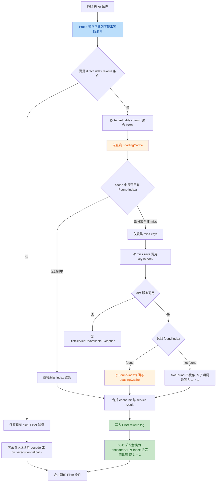

# Dict2 Filter Literal Index Rewrite Plan

## 1. 背景

当前 `dict2` 在 `Filter` 上对字典列字符串等值谓词的处理方式是：

```sql
col = 'abc'
```

会被改写为：

```sql
low_card_dict_execution(col_dict_idx, dictName, version, exprJson)
```

这条链路在语义上是正确的，但会带来一个明显的问题：

1. `low_card_dict_execution(...)` 是函数表达式，不再是简单的列等值比较
2. scan/pushdown 层很难把它识别成可下推的等值谓词
3. 最终导致本应最容易下推的 `col = literal` 失去下推优势

这会造成典型的性能劣化。

### 1.1 现象示例

同一条 SQL，仅表不同：

- `ti.vqos_dict`：存在字典配置，会触发 `dict2`
- `ti.vqos_nodict`：不存在字典配置，不会触发 `dict2`

测试 SQL：

```sql
select
  account_id as `account_id`,
  sum("count") as `nvqos_metrics_total_count`,
  sum(if(fp_user_url_abr_pts > 0, 1, 0)) as `nvqos_metrics_fp_user_url_abr_pts_abnormal_cnt`,
  toStartOfInterval(toDateTime(ts), interval 5 minute, 'Asia/Shanghai') as nvqos_timestamp
from ti.vqos_dict
where ts >= '2026-04-08 08:00:00 +08:00'
  and ts < '2026-04-09 08:00:00 +08:00'
  and account_id = '2100402624'
group by account_id, nvqos_timestamp
order by `nvqos_timestamp` DESC
limit 250000
```

观测结果：

- `ti.vqos_dict`：`10.6s`
- `ti.vqos_nodict`：`6.2s`

性能比值：

```text
10.6 / 6.2 * 100 = 170.968
```

这个结果说明：在“字符串等值过滤”这个场景里，当前 `dict2` 不是在加速，而是在阻碍下推。

## 2. 问题根因

### 2.1 当前逻辑链路

当前 `FilterRewriteStrategy` 的核心路径是：

1. 把字典列属性替换成 `LowCardDictDecode(col_dict_idx, dictName, version)`
2. 再把符合模式的布尔表达式压成 `LowCardDictExecution(col_dict_idx, dictName, version, json)`

也就是说，原始的：

```sql
account_id = '2100402624'
```

最终变成：

```sql
low_card_dict_execution(account_id_dict_idx, 'tenant/table/account_id', -1, '{"functionName":"equal",...}')
```

### 2.2 真正的问题

`low_card_dict_execution(...)` 的问题不在“语义错误”，而在“形态不利于 pushdown”：

1. scan 层最容易下推的是 `encoded_column = literal_index`
2. 现在却变成了“函数(col_idx, json)”这种高层表达式
3. 导致扫描层无法复用已有的等值谓词下推能力

因此，本次优化的本质不是“让 `dict_execution` 更快”，而是：

> 对最简单、最稳定、最适合下推的字符串等值谓词，跳过 `dict_execution`，直接改写成字典索引等值比较。

## 3. 设计目标

### 3.1 核心目标

把下面这种字典列字符串等值谓词：

```sql
col = 'abc'
```

直接改写为：

```sql
col_dict_idx = literal_index
```

其中 `literal_index` 通过 dict service 的 `/keyToIndex` 接口获得。

### 3.2 目标收益

1. 恢复 scan 侧等值比较下推
2. 降低 `Filter` 执行开销
3. 避免 `low_card_dict_execution` 成为下推屏障
4. 保持 `dict2` “尽量使用编码态”的总体设计方向

### 3.3 严格范围控制

本次替换仅针对：

1. `Filter`
2. 字典列
3. `StringType`
4. 等值查询
5. 字面量比较

即：

```sql
col = 'abc'
'abc' = col
```

不包括：

1. `IN (...)`
2. `!=`
3. `<=>`
4. `LIKE`
5. 非字符串字面量
6. `Project` / `Aggregate` / `Sort` 中的布尔条件

## 4. 外部依赖：dict service

dict service 提供如下 HTTP 接口：

```bash
curl -X POST localhost:7788/keyToIndex \
  -H "X-Tenant: bmq_ies_live" \
  -H "X-Table: dwd_live_fcdn_nss_monitor_vqos_v1" \
  -H "X-Column: cdn" \
  -H "Content-Type: application/json" \
  --data-binary @- <<'EOF'
{
  "keys": [
    "k1",
    "k2"
  ]
}
EOF
```

返回示例：

```json
{
  "results": [
    {
      "key": "k1",
      "index": 6560,
      "found": true
    },
    {
      "key": "k2",
      "index": 1599290,
      "found": true
    }
  ]
}
```

### 4.1 配置来源

dict 服务配置建议统一收敛在 `application.yml`，并直接使用“环境变量 + 默认值”的占位写法。这样最终代码只需要读取解析后的配置值，不必自己再做一轮“先读 yaml、再读 env”的分支判断。

建议统一抽象为：

```scala
case class DictServiceConfig(
    baseUrl: String,
    connectTimeoutMs: Int,
    readTimeoutMs: Int,
    cacheMaximumSize: Long,
    cacheExpireAfterWriteMinutes: Long)
```

推荐配置项：

```yaml
dict:
  service:
    base-url: ${DICT_SERVICE_BASE_URL:http://localhost:7788}
    connect-timeout-ms: ${DICT_SERVICE_CONNECT_TIMEOUT_MS:1000}
    read-timeout-ms: ${DICT_SERVICE_READ_TIMEOUT_MS:3000}
    cache:
      maximum-size: ${DICT_SERVICE_CACHE_MAXIMUM_SIZE:100000}
      expire-after-write-minutes: ${DICT_SERVICE_CACHE_EXPIRE_AFTER_WRITE_MINUTES:60}
```

其中：

1. 如果环境变量存在，优先使用环境变量
2. 如果环境变量不存在，自动回退到冒号后的默认值
3. rule/resolver 侧只消费最终配置对象，不感知来源差异

对应环境变量：

```text
DICT_SERVICE_BASE_URL
DICT_SERVICE_CONNECT_TIMEOUT_MS
DICT_SERVICE_READ_TIMEOUT_MS
DICT_SERVICE_CACHE_MAXIMUM_SIZE
DICT_SERVICE_CACHE_EXPIRE_AFTER_WRITE_MINUTES
```

### 4.2 配置注入链路（维护说明）

当前实现不让 `starry-core` 直接依赖 Spring，也不让 `RewriteWithGlobalDict` 直接读取 `application.yml`。实际链路是：

```text
application.yml
  -> gateway-thrift-service / SparkConfig
  -> TideSparkSession.spark().conf().set(...)
  -> Spark SQLConf
  -> starry-core / RewriteWithGlobalDict
```

对应代码位置：

1. `starry-core` 读取入口：
   - [RewriteWithGlobalDict.scala](file:///root/Documents/gw2/starry/starry-core/src/main/scala/org/apache/spark/sql/execution/dict2/RewriteWithGlobalDict.scala)
   - `DictServiceConfigProvider.current()`
2. metadata-aware lookup：
   - `DictConfigLookup.withBoundMetadata(...)`
   - `DictConfigLookup.getRequiredString(...)`

1. **优先用表元数据控制 dict 行为**
   - 直接把配置挂到 relation / table metadata
   - 更容易做按表、按源、按场景的精细控制
2. **`starry-core` 统一走 metadata-aware lookup**
   - 先读绑定到当前 plan 的 metadata
   - 再回退到 `SQLConf`
3. **同一 source 内先看 `tide.sql.*`，再看 `spark.sql.starry.*`**
   - `tide.sql.*` 是 hot config
   - `spark.sql.starry.*` 是 cold config
   - 这就是经典的 hot & cold config pattern
   - `tide.sql.*` 是 hot config，`spark.sql.starry.*` 是 cold config
4. **不要求 gateway 参与每个 dict 开关下发**
   - 避免配置链路过长
   - 减少网关和 rewrite 规则之间的耦合
   - 避免列式执行层和网关框架强耦合
   - 便于单测和后续独立复用

当前有效配置键如下：

```text
tide.sql.dictLiteralIndex.*          # hot
spark.sql.starry.dictLiteralIndex.*  # cold
```

如果展开为当前已使用的字段，则是：

```text
tide.sql.dictLiteralIndex.enabled
tide.sql.dictLiteralIndex.serviceBaseUrl
tide.sql.dictLiteralIndex.connectTimeoutMs
tide.sql.dictLiteralIndex.readTimeoutMs
tide.sql.dictLiteralIndex.cacheMaximumSize
tide.sql.dictLiteralIndex.cacheExpireAfterWriteMinutes

spark.sql.starry.dictLiteralIndex.enabled
spark.sql.starry.dictLiteralIndex.serviceBaseUrl
spark.sql.starry.dictLiteralIndex.connectTimeoutMs
spark.sql.starry.dictLiteralIndex.readTimeoutMs
spark.sql.starry.dictLiteralIndex.cacheMaximumSize
spark.sql.starry.dictLiteralIndex.cacheExpireAfterWriteMinutes
```

1. 元数据最靠近表语义，最适合做 dict 行为开关
2. `tide.sql.*` 作为 hot config，可以做单表 override
3. `spark.sql.starry.*` 作为 cold config，可以继续做全局 base config
4. 同一套代码可以同时支持全局默认值和单表覆盖
5. `RewriteWithGlobalDict` 不需要依赖 Spring / gateway 生命周期
6. 后续如果 `dict service` 还有新配置项，只需要：
   - 在 metadata 或 SQLConf 中增加对应 key，优先放 `tide.sql.dictLiteralIndex.*`
   - 必要时补充 `spark.sql.starry.dictLiteralIndex.*` fallback
   - 在 `DictServiceConfigProvider` 增加读取逻辑

这条链路更短，也更适合作为后续维护约束。

### 4.3 失败语义

根据约束，必须严格区分两类结果：

1. 字典服务不可用
   - 直接抛异常
2. 字典服务可用，但 key 不存在
   - 不抛业务异常
   - 将该原子谓词改写成恒不成立表达式 `1 != 1`
   - 让它在 `OR` / `AND` 组合中按标准布尔语义自然收敛

因此只需要保留服务不可用异常：

```scala
final case class DictServiceUnavailableException(msg: String) extends RuntimeException(msg)
```

### 4.4 未命中时改写为 `1 != 1` 的 OR / AND 示例

这里的“未命中”指：对字典列等值谓词 `col = 'abc'` 调用 `/keyToIndex` 后返回 `found=false`（即当前字典存储里不存在该 key）。此时该原子谓词在字典表里不可能成立，因此把它改写成 `1 != 1` 会更直观，也更贴近 SQL/计划层表达。

**OR 场景**

原 SQL：

```sql
where account_id = 'not_exist' or region = 'cn'
```

假设：

1. `account_id` 为字典列
2. `'not_exist'` 未命中 `keyToIndex`

则原子谓词等价替换为 `1 != 1`：

```sql
where 1 != 1 or region = 'cn'
```

根据布尔代数化简：

```text
(1 != 1) OR x  =>  x
```

最终等价为：

```sql
where region = 'cn'
```

**AND 场景**

原 SQL：

```sql
where account_id = 'not_exist' and region = 'cn'
```

同样 `'not_exist'` 未命中时：

```sql
where 1 != 1 and region = 'cn'
```

根据布尔代数化简：

```text
(1 != 1) AND x  =>  1 != 1
```

最终等价为：

```sql
where 1 != 1
```

## 5. 总体方案

### 5.1 改写前后对比

改写前：

```sql
account_id = '2100402624'
```

当前 `dict2`：

```sql
low_card_dict_execution(account_id_dict_idx, dictName, -1, exprJson)
```

改进后：

```sql
account_id_dict_idx = 123456
```

其中 `123456` 由 `/keyToIndex` 查询得到。

### 5.2 总流程图



## 6. Probe & Build 二阶段设计

本次改动必须继续遵循当前 `dict2` 的两阶段哲学：

1. **Probe**
   - 只做识别、解析、打标签
   - 不直接改写表达式结构
2. **Build**
   - 只消费 tag
   - 生成最终替换后的 `Filter` 条件

### 6.1 Probe 阶段职责

Probe 只负责回答四个问题：

1. 哪些谓词可以做 `literal -> index` 改写？
2. 每个 literal 对应哪个 index？
3. 哪些谓词应改写为 `1 != 1`
4. 哪些谓词应该保持现有 `dict_execution` 路径？

### 6.2 Build 阶段职责

Build 只负责：

1. 把已命中的谓词改写成 `encodedAttr = Literal(index)`
2. 把未命中的 literal equality 谓词改写成 `1 != 1`
3. 把其余谓词继续交给当前 `FilterRewriteStrategy`

这样可以确保：

1. probe 不引入结构性副作用
2. build 不承担外部 IO
3. 逻辑边界稳定，容易调试

## 7. Probe 阶段详细设计

### 7.1 候选谓词识别

只识别以下两种形式：

```scala
EqualTo(attr: AttributeReference, Literal(v, StringType))
EqualTo(Literal(v, StringType), attr: AttributeReference)
```

同时满足：

1. `attr` 是字典列
2. `v != null`
3. `attr` 对应的逻辑列类型是字符串

### 7.2 按字典维度批量解析

为了减少 HTTP 次数，probe 不应逐个 predicate 调 `/keyToIndex`，而应：

1. 把所有候选谓词按 `DictInfo(tenant, table, column)` 分组
2. 对同一组收集所有 literal
3. 批量调用一次 `/keyToIndex`

这样同一列多个等值 literal 可以共享一次网络请求。

### 7.3 Probe 阶段新增 tag

建议新增专门给 `Filter` 使用的 tag：

```scala
private[dict2] val FILTER_LITERAL_INDEX_REWRITE_TAG =
  TreeNodeTag[Seq[LiteralIndexRewrite]]("dict_filter_literal_index_rewrite")
```

其中：

```scala
case class LiteralIndexRewrite(
    originalPredicate: Expression,
    dictInfo: DictInfo,
    valueExprId: ExprId,
    literal: String,
    resolvedIndex: Option[Int])
```

这里保留 `originalPredicate` 的意义是：

1. build 阶段不需要重新做复杂模式识别
2. 可以直接用 `semanticEquals` 或结构匹配替换
3. `resolvedIndex = None` 可明确表达“未命中，build 时改成 `1 != 1`”
4. 可读性更强，方便调试日志输出

### 7.4 Probe 阶段伪代码

```scala
def probeFilterLiteralIndexRewrites(
    filter: Filter,
    dictInfos: Map[ExprId, DictInfo]): Seq[LiteralIndexRewrite] = {

  val predicates = splitConjunctivePredicates(filter.condition)
  val candidates = predicates.flatMap(matchStringDictEquality(_, dictInfos))

  val grouped = candidates.groupBy(_.dictInfo)

  grouped.flatMap { case (info, items) =>
    val keys = items.map(_.literal).distinct
    val results = resolver.resolveBatch(info, keys)

    items.map { item =>
      results.get(item.literal) match {
        case Some(Found(index)) =>
          LiteralIndexRewrite(
            item.originalPredicate,
            info,
            item.valueExprId,
            item.literal,
            Some(index))
        case Some(NotFound) =>
          LiteralIndexRewrite(
            item.originalPredicate,
            info,
            item.valueExprId,
            item.literal,
            None)
        case None =>
          LiteralIndexRewrite(
            item.originalPredicate,
            info,
            item.valueExprId,
            item.literal,
            None)
      }
    }
  }.toSeq
}
```

## 8. Build 阶段详细设计

### 8.1 核心策略

build 时不再走“先 decode 再 execution”的统一路径，而是改成 predicate 级分流：

1. 如果当前 predicate 命中了 `FILTER_LITERAL_INDEX_REWRITE_TAG`
   - `resolvedIndex = Some(index)` 时，改成 `encodedAttr = Literal(index)`
   - `resolvedIndex = None` 时，改成 `Not(EqualTo(Literal(1), Literal(1)))` 或等价的 `1 != 1`
2. 否则
   - 保持现有路径

### 8.2 为什么必须 predicate 级处理

如果先对整个 `condition` 做全局替换，再统一 decode，很容易出现：

1. 已改成 `encodedAttr = Literal(index)` 的子树又被后续 decode 逻辑误处理
2. direct-index 谓词和普通 dict 谓词相互干扰

因此建议把 `Filter` 改成：

```scala
predicates.map(rewriteSinglePredicate).reduce(And)
```

而不是：

```scala
rewriteWholeCondition(condition)
```

这是本次设计中最重要的“可维护性选择”之一。

### 8.3 Build 阶段伪代码

```scala
val predicates = SplitConjunctivePredicates(filter.condition)
val rewrites = filter.getTagValue(FILTER_LITERAL_INDEX_REWRITE_TAG).getOrElse(Seq.empty)

val rewriteMap = rewrites.map(r => r.originalPredicate -> r).toMap

val newPredicates = predicates.map { predicate =>
  rewriteMap.find { case (orig, _) => predicate.semanticEquals(orig) } match {
    case Some((_, rewrite)) =>
      rewrite.resolvedIndex match {
        case Some(index) =>
          val encodedAttr = mapping(rewrite.valueExprId)._2
          EqualTo(encodedAttr, Literal(index))
        case None =>
          Not(EqualTo(Literal(1), Literal(1)))
      }

    case None =>
      val decoded = predicate.transformUp {
        case attr: AttributeReference if mapping.contains(attr.exprId) =>
          val (info, encodedAttr) = mapping(attr.exprId)
          new LowCardDictDecode(encodedAttr, info.dictName, info.version)
      }
      Dict2RewriteUtils.optimizeSinglePredicate(decoded, jsonConverter)
  }
}

Filter(newPredicates.reduce(And), filter.child)
```

这里的关键点是：

1. direct-index 分支与旧路径完全分离
2. 逻辑简单，未来支持更多 direct rewrite 场景时只需扩展 `rewriteSinglePredicate`

## 9. Dict Resolver 与缓存设计

### 9.1 新增抽象层

建议新增接口：

```scala
trait DictLiteralIndexResolver {
  def resolveBatch(info: DictInfo, keys: Seq[String]): Map[String, DictLookupResult]
}
```

返回类型：

```scala
sealed trait DictLookupResult
case class Found(index: Int) extends DictLookupResult
case object NotFound extends DictLookupResult
```

建议实现分层：

1. `HttpDictLiteralIndexResolver`
   - 只负责 HTTP 调用
2. `CachedDictLiteralIndexResolver`
   - 只负责缓存
3. `ConfigurableDictLiteralIndexResolver`
   - 负责按配置创建实例

### 9.2 缓存要求

根据约束，必须使用 `LoadingCache`。

建议 cache key：

```scala
case class DictKeyLookupCacheKey(
    tenant: String,
    table: String,
    column: String,
    key: String)
```

缓存 value：

```scala
DictLookupResult
```

建议缓存策略：

1. `Found(index)` 缓存
2. `NotFound` 不缓存
   - 每次 probe 都基于当前 dict 存储状态重新判断
3. 服务不可用不缓存
   - 让系统在服务恢复后可重新尝试

### 9.3 为什么不缓存 `NotFound`

`NotFound` 代表“当前存储状态下没有该 key”，但这类结果可能随着字典加载或存储状态变化而变化，因此不应长期缓存。

同时，当前方案已经不再把 `NotFound` 视为异常，而是把对应原子谓词重写成恒不成立表达式 `1 != 1`。因此 `NotFound` 更适合作为一次 probe 过程中的临时解析结果，而不是稳定缓存项。

## 10. 异常与可观测性

### 10.1 异常语义

建议统一为：

1. 服务不可用
   - `DictServiceUnavailableException`

### 10.2 报错内容建议

服务不可用异常信息建议至少带上：

1. tenant
2. table
3. column
4. literal
5. 原始 predicate

例如：

```text
dict service unavailable: tenant=bmq_ies_live, table=dwd_live_fcdn_nss_monitor_vqos_v1, column=account_id, key=2100402624, predicate=(account_id = '2100402624')
```

### 10.3 建议日志

在 probe 阶段建议增加 debug/info 级日志：

1. 命中了多少个 direct-index rewrite 候选
2. 每个 `(tenant, table, column)` 批量查询了多少个 key
3. 命中/未命中数量
4. 有多少个原子谓词被改写成 `1 != 1`
5. 是否发生服务异常

这些日志只记录统计信息，不建议记录大量完整 key 内容，以免日志膨胀。

## 11. 与现有规则的关系

### 11.1 与 `dict_execution` 的关系

本次方案并不是废弃 `low_card_dict_execution`，而是为它增加一个更优先的特化分支：

1. `string equality on dict column` -> direct index equality
2. 其他仍可 JSON 化的单列布尔谓词 -> `low_card_dict_execution`
3. 再不满足条件的 -> decode fallback

即优先级为：

```text
direct index equality
  > dict_execution
  > dict_decode fallback
```

### 11.2 与 dict2 总体设计的关系

这与 `dict2` 的总体思想是一致的：

1. 尽量保持编码态
2. 尽量利用底层执行和下推能力
3. 只在确实需要值语义时 decode

从这个角度看，`col_dict_idx = literal_index` 比 `dict_execution(...)` 更接近“最原生的编码态比较”。

## 12. 测试计划

### 12.1 单测

需要新增/补充以下单测：

1. `Filter` 中 `dict_col = 'abc'` 改写为 `encodedAttr = Literal(index)`
2. `'abc' = dict_col` 同样生效
3. 非字符串 literal 不触发 direct rewrite
4. 非等值谓词不触发 direct rewrite
5. key 不存在时该原子谓词改写成 `1 != 1`
6. dict service 不可用时抛 `DictServiceUnavailableException`
7. 混合条件下只改写命中的 predicate

例如：

```sql
account_id = '2100402624' and fp_user_url_abr_pts > 0
```

只改写第一段。

### 12.2 Resolver 单测

需要为 resolver 单独加测试：

1. HTTP header 组装是否正确
2. 批量请求 body 是否正确
3. `found=false` 是否映射为 `NotFound`
4. `5xx` / timeout 是否映射为 `DictServiceUnavailableException`
5. `Found(index)` 是否会命中 cache
6. `NotFound` 是否不会进入 cache

### 12.3 逻辑计划测试

需要验证最终 `Filter` 计划形态：

1. 直接命中的等值条件不再出现 `low_card_dict_execution(...)`
2. 命中时直接出现 `EqualTo(encodedAttr, Literal(index))`
3. 未命中时直接出现 `1 != 1`

### 12.4 E2E 验证

建议用当前已经存在的真实表和查询继续验证：

1. `ti.vqos_dict`
2. `ti.vqos_nodict`
3. 比较执行时间
4. 比较 scan/pushdown 行为

重点观察：

1. scan filter 是否恢复下推
2. 逻辑/物理计划中是否不再出现这类等值条件的 `low_card_dict_execution`
3. 性能是否接近甚至优于 `nodict`

## 13. 分阶段落地建议

### 13.1 第一阶段

只支持：

1. `Filter`
2. `StringType`
3. `EqualTo`
4. 单 literal

先确保：

1. 语义正确
2. pushdown 恢复
3. 服务调用/缓存稳定

### 13.2 第二阶段

在第一阶段稳定后，可考虑扩展：

1. `IN ('a', 'b', 'c')`
2. 同列 `OR` 条件
3. 更丰富的 direct-index rewrite

### 13.3 TODO: 自适应 Pushdown

当前第一阶段的目标是“让可转成 `encoded equality` 的条件尽量进入 scan pushdown”，但后续需要明确补一层**自适应 pushdown 决策**，因为“可下推”并不等于“必然有收益”。

需要关注的典型 case：

```sql
select stream as `stream_name`,
       sum(
         case
           when (is_sla_tag = 'true')
             and (session_type = 'sink')
             and (is_relay = 'false')
             and (local_node_type = 'pull')
             and remote_type = 'user'
           then "count"
         end) as `nvqos_metrics_pull_req_count`,
       toStartOfInterval(toDateTime(ts), interval 1 minute, 'Asia/Shanghai') as nvqos_timestamp
from ti.vqos_dict
where ts >= '2026-04-08 08:00:00 +08:00'
  and ts < '2026-04-09 08:00:00 +08:00'
  and session_type = 'sink'
  and local_node_type = 'pull'
  and is_relay = 'false'
  and remote_type = 'user'
  and format not in ('webrtc','webrtc-rs')
  and response_status_code = '404'
  and volcano_account_id = '2100003528'
group by stream_name, nvqos_timestamp
order by `nvqos_metrics_pull_req_count` DESC
limit 2
```

这个 case 说明后续不能只看“某个 filter 是否能被下推”，还要评估：

1. 该 pushdown 是否真的减少 scan 成本
2. 该 pushdown 是否会影响底层并行度、数据分布或执行路径
3. 多个 filter 组合下，哪些条件值得下推，哪些条件更适合保留在上层执行
4. dict literal rewrite 与其他普通 filter 一起出现时，是否需要 selective pushdown 而不是全量 pushdown

因此，后续建议补一个独立 TODO：

1. 为 pushdown 增加收益评估或策略开关
2. 支持按表、按列、按谓词类型做差异化控制
3. 在 e2e 基准中同时比较：
   - 不下推
   - 只下推时间过滤
   - 下推 dict encoded equality
   - 全量下推
4. 用真实收益而不是“理论可下推”来决定最终策略

### 13.4 暂不建议现在做的扩展

当前不建议把范围直接扩大到：

1. `Project` bool expr
2. `Aggregate` bool expr
3. 多列复合 direct-index predicate

原因是这些场景会重新引入：

1. probe/build 边界复杂化
2. 终止性问题
3. 与已有 bool execution 优化的职责重叠

## 14. 方案总结

本方案的关键点可以总结为三句话：

1. 对 `Filter` 中最简单的字符串等值字典谓词，不再走 `dict_execution`，而是直接改写成 `encoded index equality`
2. `literal -> index` 的外部查询放在 probe 阶段完成，build 阶段只消费 tag，保持二阶段边界清晰
3. 通过独立 resolver、配置、异常和 `LoadingCache` 抽象，把外部字典服务访问封装成可扩展、可维护的能力

最终预期是：

> 让 `dict2` 在“字符串等值过滤”这个最常见的场景里，重新成为 pushdown 的助力，而不是阻碍。
