# Dict2 Project Bool Expression Optimization

## 1. 背景与问题

### 1.1 背景

在 `dev/test_vqos_dict.sh` 对 `ti.vqos_dict` 的真实查询中，`where` 子句里的 dict 列过滤已经被优化成 `low_card_dict_execution`，但是 `Aggregate` 前一个 `Project` 中，由 `sum(case when ... then "count" end)` 引入的布尔条件仍然大量出现：

```sql
low_card_dict_decode(col_dict_idx, dictName, -1) = 'xxx'
```

### 1.2 问题定义

这会带来两个问题：

1. `Project` 提前 decode，打破“尽量晚 decode”的原则。
2. native expression 转换器看到普通表达式子树时会放弃进一步 native 化，出现日志：

```text
children has normal expression, skip transform native(... CASE WHEN ... )
```

### 1.3 真实日志证据（内嵌）

下面直接内嵌当时从 `gw2.log` 中摘出的关键片段，避免后续日志滚动导致引用失效：

```text
INFO ... children has normal expression, skip transform native(
  {"functionName":"swi...NT"}},
  CASE WHEN ((((low_card_dict_decode(is_sla_tag_dict_idx#197, bmq_ies_live/dwd_live_fcdn_nss_monitor_vqos_v1/is_sla_tag, -1) = true)
    AND (low_card_dict_decode(session_type_dict_idx#178, bmq_ies_live/dwd_live_fcdn_nss_monitor_vqos_v1/session_type, -1) = sink))
    AND (low_card_dict_decode(is_relay_dict_idx#175, bmq_ies_live/dwd_live_fcdn_nss_monitor_vqos_v1/is_relay, -1) = false))
    AND ((low_card_dict_decode(local_node_type_dict_idx#196, bmq_ies_live/dwd_live_fcdn_nss_monitor_vqos_v1/local_node_type, -1) = pull)
    AND (low_card_dict_decode(remote_type_dict_idx#185, bmq_ies_live/dwd_live_fcdn_nss_monitor_vqos_v1/remote_type, -1) = user)))
  THEN count#74L END)
```

```text
+- ColumnarProject [
     stream#44,
     applyfunctionexpression(..., ts#62, 30) AS _groupingexpression#173,
     CASE WHEN ((((low_card_dict_decode(is_sla_tag_dict_idx#197, ..., -1) = true)
       AND (low_card_dict_decode(session_type_dict_idx#178, ..., -1) = sink))
       AND (low_card_dict_decode(is_relay_dict_idx#175, ..., -1) = false))
       AND ((low_card_dict_decode(local_node_type_dict_idx#196, ..., -1) = pull)
       AND (low_card_dict_decode(remote_type_dict_idx#185, ..., -1) = user)))
     THEN count#74L END AS embedded_agg_project_group_0#218L
   ]
```

这些日志说明：

1. `CASE WHEN` 条件里存在多段 `low_card_dict_decode(...)=literal`
2. 对应的 `ColumnarProject` 正是 `Aggregate` 前一层
3. native 转换器因为子表达式里混入“普通表达式”而跳过了完整 native 化

## 2. 根因与现状

### 2.1 改动前的根因（Why）

在改动前，`dict2` 只有 `FilterRewriteStrategy` 会把布尔谓词从：

```sql
low_card_dict_decode(idx) = 'x'
```

改写成：

```sql
low_card_dict_execution(idx, dictName, version, json)
```

但是 `ProjectRewriteStrategy` 只负责：

1. 把属性替换成编码列
2. 在 `REQUIRED_DECODE_TAG` 命中时插入 `LowCardDictDecode`

它不会继续识别 `Project` 内部的 bool 子表达式，因此：

- `select city = 'Beijing' as is_bj`
- `case when city = 'Beijing' then ... end`
- `case when city in (...) then ... end`
- `case when city = 'x' and category = 'y' then ... end`

这类表达式都会停留在 `decode + compare` 形态。

### 2.2 改动后的现状（What Changed）

现在 `ProjectRewriteStrategy` 会在完成“属性替换/必要 decode”之后，对整个表达式树里的 resolved `BooleanType` 子树统一做一次 `optimizeBooleanExpressions(...)`，尝试把可执行的 bool predicate 改写为 `LowCardDictExecution`。

`Aggregate` 场景额外复杂：为了让 `CASE WHEN` 的 condition 能被 execution 化，同时又不提前在 child decode（保持“尽量晚 decode”），我们在 `AggregateRewriteStrategy` 内对 `aggregateExpressions` 做了：

1. `injectDictDecodesInBooleanSubtrees(expr, mappingAfterDecode)`：只在 bool 上下文里播种 decode（并且对 `LowCardDictDecode/Execution` 做剪枝，保证终止性）
2. 用 `mappingAfterDecode` 把 `AttributeReference` 替换成 `encodedAttr`
3. `optimizeBooleanExpressions(...)`：把符合 `single-decode + 单列引用 + 可 JSON 化` 的 bool 子树替换成 `LowCardDictExecution`

## 3. 设计目标与范围

### 3.1 设计目标

目标不是“Project 完全不 decode”，而是：

> 对于 `Project` 内部可以独立下沉到 dict 引擎执行的布尔谓词，优先改写成 `low_card_dict_execution`；只有真正需要值语义且无法 execution 化的部分，才保留 decode。

这符合几个设计原则：

1. **接口简单，内部更深**
   - 对外仍然只有 `ProjectRewriteStrategy`
   - 内部把“布尔谓词 execution 化”抽成通用工具

2. **避免逻辑分叉**
   - 不再让 `Filter` 和 `Project` 各自维护一套布尔谓词识别逻辑
   - 统一复用同一套 `single-decode => dict_execution` 规则

3. **尽量延迟 decode**
   - decode 仍然是兜底策略
   - bool predicate 优先走 execution

### 3.2 不做的事

这次改动明确 **不** 做下面几件事：

1. 不支持“一个 execution 节点同时处理多列字典条件”
2. 不改变 `Aggregate` / `Sort` 的 decode 边界规则
3. 不修改最终输出 decode 机制
4. 不对无法 JSON 化的表达式强行执行 native 化

这样可以把改动严格收敛在 `Project bool expression` 这一层。

## 4. 方案设计

### 4.1 支持的 SQL bool expr 形态

当前实现采用“通用布尔子表达式优化”，不为 `CASE WHEN` 单独写特判，而是对 `Project` 中所有 resolved 的 `BooleanType` 子表达式做 `transformUp`。

因此天然支持以下模式：

#### 4.1.1 单列布尔谓词

```sql
city = 'Beijing'
city <> 'Beijing'
city in ('a', 'b')
city like '%foo%'
not(city in ('a', 'b'))
```

前提是：

1. 谓词里最终只依赖 **一个** `LowCardDictDecode`
2. 把这个 decode 替换成原始列名后，表达式仍只引用这一列
3. `ExpressionJsonConverter` 能把它转成 native JSON

#### 4.1.2 `CASE WHEN` / `IF` 中的条件

```sql
case when city = 'Beijing' then id end
case when city = 'Beijing' and category = 'A' then id end
if(city = 'Beijing', 1, 0)
```

这里的关键点是：

- 顶层 `CASE WHEN` 不是 bool
- 但它的 condition 子树是 bool
- `transformUp` 会先把叶子布尔比较改成 `low_card_dict_execution`
- 再把 `AND` / `OR` / `NOT` 保留下来拼接

#### 4.1.3 多列组合条件

例如：

```sql
city = 'Beijing' and category = 'A'
```

不会尝试把整个 `AND` 一次性压成“多列 execution”。

而是改成：

```sql
low_card_dict_execution(city_dict_idx, ...)
AND
low_card_dict_execution(category_dict_idx, ...)
```

这是当前最稳妥、最容易维护的做法。

### 4.2 实现方案（关键代码点）

核心改动在 [RewriteWithGlobalDict.scala](file:///root/Documents/gw2/starry/starry-core/src/main/scala/org/apache/spark/sql/execution/dict2/RewriteWithGlobalDict.scala)：

#### 4.2.1 抽出通用布尔优化能力

在 `Dict2RewriteUtils` 中新增：

- `optimizeConjunctiveCondition()`
- `optimizeBooleanExpressions()`
- `optimizeSingleBooleanPredicate()`

职责划分：

- `optimizeConjunctiveCondition`
  - 继续服务 `Filter`
  - 对 `AND` 拆分后的谓词逐个尝试 execution 化

- `optimizeBooleanExpressions`
  - 服务 `Project`
  - 对任意表达式树中的 resolved bool 子表达式做 bottom-up 优化

- `optimizeSingleBooleanPredicate`
  - 真正的核心逻辑
  - 识别“单个 `LowCardDictDecode` + 单列引用 + 可 JSON 化”模式

#### 4.2.2 `ProjectRewriteStrategy` 接入 bool 优化

原流程：

1. 把映射列替换成 `encodedAttr` 或 `LowCardDictDecode`
2. 直接 `Alias(...)`

新流程：

1. 先完成原有替换
2. 再调用 `Dict2RewriteUtils.optimizeBooleanExpressions(...)`
3. 最后 `Alias(...)`

这样 `CASE WHEN`、`IF`、普通布尔投影都能统一受益。

#### 4.2.3 `FilterRewriteStrategy` 复用同一能力

把原本私有的 `optimizeCondition` 下沉到 `Dict2RewriteUtils.optimizeConjunctiveCondition`，避免 `Filter` 和 `Project` 以后出现行为漂移。

#### 4.2.4 关键流程图（Project vs Aggregate）

下面用流程图描述“bool 播种 + execution 化”在 `Project` 与 `Aggregate` 场景的差异点。

```mermaid
flowchart TD
  subgraph Project["ProjectRewriteStrategy"]
    P0["输入表达式 expr"] --> P1["属性替换: attr -> encodedAttr 或 decode(encodedAttr) (requiredDecode 时)"]
    P1 --> P2["optimizeBooleanExpressions: 对所有 resolved BooleanType 子树做 transformUp"]
    P2 --> P3["若某 bool 子树恰好包含 1 个 LowCardDictDecode\n且仅引用该列 且可转 native json\n=> 替换成 LowCardDictExecution"]
    P3 --> P4["Alias 输出 (保持 exprId/名称)"]
  end

  subgraph Agg["AggregateRewriteStrategy (aggregateExpressions)"]
    A0["输入 aggregate expr"] --> A1["injectDictDecodesInBooleanSubtrees\n(只在 bool context 内播种 decode;\n遇到 Decode/Execution 直接剪枝)"]
    A1 --> A2["属性替换: attr -> encodedAttr (mappingAfterDecode)"]
    A2 --> A3["optimizeBooleanExpressions: bool 子树执行化 (同 Project)"]
    A3 --> A4["NamedExpression 输出 (必要时 Alias 保持 exprId)"]
  end
```



另外，`injectDictDecodesInBooleanSubtrees` 的实现思路可以用伪代码表达（强调“终止性/幂等性”）：

```scala
def seed(expr, inBoolCtx):
  match expr:
    case LowCardDictDecode | LowCardDictExecution:
      return expr               // 剪枝：禁止深入 wrapper children
    case AttributeReference if inBoolCtx && mapping.contains(exprId):
      return LowCardDictDecode(encodedAttr, dictName, version)
    case other:
      next = inBoolCtx || (other.dataType == BooleanType && other.resolved)
      return other.mapChildren(child => seed(child, next))
```

### 4.3 为什么这个设计更优雅

相比“单独给 `CASE WHEN` 写规则”，当前实现有几个明显好处：

1. **面向语义，不面向语法糖**
   - 我们优化的是“布尔子表达式”
   - 而不是硬编码 `CASE WHEN`、`IF`、`WHERE`

2. **复用现有成熟逻辑**
   - 直接沿用 `Filter` 已验证过的 JSON 转换路径
   - 降低新 bug 风险

3. **天然支持组合表达式**
   - `CASE WHEN a and b then ...`
   - `IF(not(a in (...)), ...)`
   - 都不需要额外分支

4. **继续保持 decode 为兜底**
   - 能 execution 的就 execution
   - 不能 execution 的保持原表达式，不影响正确性

## 5. 事故复盘：一次死循环/栈溢出

这一段是对“优化过程中引入死循环/栈溢出”的一次完整复盘，目的是让后续同类改动能快速规避。

### 5.1 为什么会出现（语义层面的冲突点）

我们为了让 `CASE WHEN` 的布尔条件能被 `optimizeBooleanExpressions` 命中，会先在 bool 子树里“播种”出 `LowCardDictDecode`（即让原本是 idx 的列在语义上回到 string 再参与比较），再尝试把 `single-decode` 模式压成 `LowCardDictExecution`。

问题出在“播种”这一步如果不是幂等的，就会和 `group by` / mapping 的替换规则发生冲突，导致 rewrite 不收敛：

1. `Aggregate`/`GroupBy` 的替换规则会让 dict 列长期保持为 `*_dict_idx`（mapping 仍然存在）
2. `injectDictDecodesInBooleanSubtrees` 如果用树遍历去“看到 Attribute 就包一层 decode”，而且遍历会继续深入 `LowCardDictDecode` 的 children
3. 由于 `LowCardDictDecode` 本身是一个 `TernaryExpression(child, dictName, version)`，其 `child` 仍是一个 `AttributeReference`（且仍会命中 mapping）
4. 遍历深入后会再次命中同一个 `AttributeReference`，再包一层 decode，形成：

```text
attr
=> low_card_dict_decode(attr, ...)
=> low_card_dict_decode(low_card_dict_decode(attr, ...), ...)
=> ...
```

在真实 SQL 的 `AND` 链、`CASE WHEN` 组合条件里，bool 节点层数更深，这种“深入自己生成出来的节点再重写”的行为会被放大，最终导致死循环/栈溢出或长时间卡住。

### 5.2 如何发现（超过 30s 即异常）

复现路径是 e2e 的 `dev/test_vqos_dict.sh`：

1. 服务启动正常
2. 发起 `ti.vqos_dict` 的真实查询后，HTTP 长时间不返回（或 ttfb 非常大），超过 30s 基本可以判定 rewrite 不收敛或表达式树爆炸
3. `gw2.log` 里会出现明显的异常信号：
   - 早期版本表现为 `preTransform SparkPlan took: ~140000 ms`（约 140s）
   - 后续直接演化为 `java.lang.StackOverflowError`

下面内嵌当时抓到的关键错误栈（只保留和根因强相关的部分）：

```text
java.lang.StackOverflowError: null
  at org.apache.spark.sql.execution.dict2.LowCardDictDecode.<init>(LowCardDictEncoding.scala:28)
  at org.apache.spark.sql.execution.dict2.Dict2RewriteUtils$$anonfun$injectDictDecodesInBooleanSubtrees$... (RewriteWithGlobalDict.scala:686)
  at org.apache.spark.sql.catalyst.trees.TreeNode.transformDownWithPruning(TreeNode.scala:584)
  ...
```

### 5.3 怎样定位（用日志把“冲突点”钉死）

定位顺序是“先从现象找到具体栈帧，再回到语义分析”：

1. `grep` 日志里的 `StackOverflowError`，确认是 Spark 侧 transform/rewrite 在递归创建表达式节点
2. 栈顶直接指向 `LowCardDictDecode.<init>`，并回溯到 `injectDictDecodesInBooleanSubtrees`
3. 回到表达式数据结构：`LowCardDictDecode` 是 `TernaryExpression`，children 里包含 `child`（dict idx attr），如果遍历不做剪枝，就会不断“再命中 child 再包一层”
4. 再结合经验：`group by` 替换规则保证 mapping 仍存在（idx attr 仍在表达式树里），这就解释了为什么它会“永远可匹配、永远可继续包”

这一步完成后，可以把根因总结为一句话：

> bool expr 的 seeding 规则在语义上“可重复应用且每次都会改变树”，并且会深入到自己生成的 `LowCardDictDecode` 节点里；而 group by/mapping 规则保证其 child attr 永远可匹配，从而导致 rewrite 不收敛（最终栈溢出或长时间卡死）。

### 5.4 解决方案的关键约束（终止性 + 幂等性）

设计目标不是“更复杂的规则”，而是确保 **终止性 + 幂等性**：

1. `injectDictDecodesInBooleanSubtrees` 必须只在 bool context 内生效（避免对非 bool 的计算播种 decode）
2. 必须把 `LowCardDictDecode` / `LowCardDictExecution` 视为“边界节点”：一旦命中就停止向下遍历，禁止进入其 children
3. 实现上避免 `transformUp/transformDown` 这种容易“访问到新生成节点 children”的通用遍历，改为手写一个带 `inBoolCtx` 参数的递归重写（见 4.2.4 伪代码）

### 5.5 经验总结（可复用的 guardrail）

1. 所有 rewrite/transform 类优化都要显式证明“会收敛”：不能让规则对自己生成的节点继续生效且每次都会继续增长
2. 对表达式类 rewrite，遇到“包装器节点”（wrapper expression）要当作边界节点剪枝（decode/execution 都属于 wrapper）
3. e2e 必须有“超时即失败”的硬阈值（30s 规则很有效），否则容易把非收敛问题误判成“环境慢”
4. 复盘时优先固化可重复的证据（关键日志片段、栈顶函数、触发 SQL），避免以后只能靠记忆

## 6. 测试与验证

### 6.1 单测

新增了针对性测试，位于 [RewriteWithGlobalDictSuite.scala](file:///root/Documents/gw2/starry/starry-core/src/test/scala/org/apache/spark/sql/execution/dict2/RewriteWithGlobalDictSuite.scala)：

1. `Project boolean predicate should use LowCardDictExecution instead of decode`
2. `Project CASE WHEN predicate should rewrite dict comparisons to executions`
3. `Dict2RewriteUtils.injectDictDecodesInBooleanSubtrees should not traverse into existing LowCardDictDecode subtree`

执行命令：

```bash
./mvnw -pl starry/starry-core test \
  -DfailIfNoTests=false \
  -DwildcardSuites=org.apache.spark.sql.execution.dict2.RewriteWithGlobalDictSuite,org.apache.spark.sql.execution.dict2.RewriteWithGlobalDictSQLSuite
```

结果以实际输出为准（建议在 MR 中粘贴关键统计行）。

### 6.2 E2E 验证方式

建议继续使用：

```bash
bash dev/test_vqos_dict.sh
```

然后检查：

1. `output/gateway-thrift-service/logs/gw2.log`
2. `Aggregate` 前的 `ColumnarProject`
3. `CASE WHEN` 条件是否从：

```sql
low_card_dict_decode(...) = ...
```

变成：

```sql
low_card_dict_execution(...)
```

重点 grep：

```bash
grep -nE "low_card_dict_decode|low_card_dict_execution|children has normal expression|ColumnarProject|CASE WHEN" \
  output/gateway-thrift-service/logs/gw2.log
```

## 7. 预期收益

如果 E2E 与单测一致，预期收益是：

1. `Project` 中布尔比较减少 decode
2. native expression 转换命中率提升
3. `Aggregate` 前不必要的字符串物化减少
4. dict 列延迟到更靠后的边界再 decode

## 8. 后续可继续演进的方向

1. 支持同列复合布尔谓词整体 execution 化
   - 例如 `city = 'a' or city = 'b'`

2. 识别更多等价结构
   - `IN` / `INSET`
   - `StartsWith` / `EndsWith` / `Contains`

3. 增加基于真实 SQL 的 dict2 SQL suite
   - 直接构造 `CASE WHEN + Aggregate` 逻辑计划断言

4. 补充 e2e 验证记录
   - 每次改动都附上 `gw2.log` 中的计划对比片段
