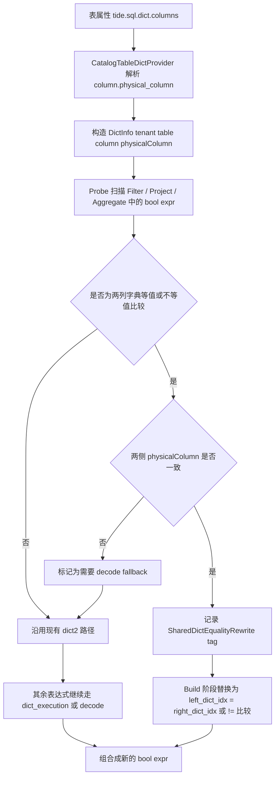

# Dict2 Shared Dict Bool Rewrite Plan

## 1. 背景

当前 `dict2` 的核心优化目标是：

> 尽量让字典列在逻辑计划和列式执行中保持编码态，只在语义边界或最终输出时解码。

在以下场景中，这个目标还没有充分发挥作用：

```sql
if(local_node_name = remote_node_name, '1', '0') = '0'
```

问题在于：

1. `local_node_name` 和 `remote_node_name` 都是字典列
2. 但当前规则只知道“它们各自是字典列”，并不知道它们是否共享同一个全局字典
3. 因此 `local_node_name = remote_node_name` 这种双列比较无法直接在编码态下完成
4. 规则只能退化到 `dict_decode` 后再比较，导致引入昂贵的字符串比较和 decode 开销

这会让 `vqos_dict` 相比 `vqos_nodict` 出现明显性能劣化。

## 2. 现象与问题 SQL

### 2.1 Case SQL

```sql
select
  toStartOfInterval(toDateTime(ts), INTERVAL 5 minute, 'Asia/Shanghai') as vqos_datetime,
  sum(client_first_frame_time) / sum("count") as vqos_source_client_first_frame_time
from ti.vqos_dict
where ts >= '2026-04-08 08:00:00 +08:00'
  and ts < '2026-04-09 08:00:00 +08:00'
  and (
    if(local_node_name = remote_node_name, '1', '0') = '0'
    and local_node_type = 'source'
    and online not in ('0')
    and remote_node_type = 'source'
    and useful not in ('0', '2', '3')
  )
  and (
    session_type = 'source'
    and is_relay = 'true'
    and is_client_first_frame_success = '1'
    and is_last_tag = 'true'
  )
group by toStartOfInterval(toDateTime(ts), INTERVAL 5 minute, 'Asia/Shanghai')
order by vqos_datetime desc
limit 20000 offset 0
```

### 2.2 现象

- `ti.vqos_dict`：`30.6s`
- `ti.vqos_nodict`：`15s`

```text
30.6 / 15 * 100 = 204
```

### 2.3 根因

对这条 SQL，真正需要聚焦的 filter expr 是：

```sql
if(local_node_name = remote_node_name, '1', '0') = '0'
```

当前规则在这里没有利用字典优势：

1. `local_node_name = remote_node_name` 没法在编码态比较
2. 只能把两列 decode 成字符串再做等值判断
3. decode 发生在 filter 里，成本高且阻碍后续优化

## 3. 设计目标

### 3.1 核心目标

让下面这种 bool expr：

```sql
local_node_name = remote_node_name
```

在满足条件时，直接改写为：

```sql
local_node_name_dict_idx = remote_node_name_dict_idx
```

前提是：

1. 两列都是字典列
2. 两列共享同一个物理全局字典

进一步，原始表达式：

```sql
if(local_node_name = remote_node_name, '1', '0') = '0'
```

可以改写为：

```sql
if(local_node_name_dict_idx = remote_node_name_dict_idx, '1', '0') = '0'
```

### 3.2 目标收益

1. 避免不必要的 `dict_decode`
2. 把双列等值比较留在编码态完成
3. 扩大 `dict2` 对 bool expr 的优化范围
4. 保持与现有 `probe & build` 两阶段模式一致

### 3.3 非目标

本次设计不处理：

1. 两列虽然都是字典列，但物理字典不一致的情况
2. 跨表共享字典的 join 语义
3. 两列比较之外的任意多列共享字典表达式
4. 非等值比较（`>`, `<`, `LIKE`）

## 4. 核心设计：引入 physical_column

### 4.1 `DictInfo` 从三元组升级为四元组

当前：

```scala
case class DictInfo(tenant: String, table: String, column: String)
```

建议升级为：

```scala
case class DictInfo(
    tenant: String,
    table: String,
    column: String,
    physicalColumn: String)
```

语义拆分：

1. `tenant`
2. `table`
3. `column`
   - 逻辑列名
   - 对应 schema 中用户可见的列名
4. `physicalColumn`
   - 共享字典所在的物理列名
   - 用于构造真正的 `dictName`

### 4.2 `dictName` 构造规则变化

当前：

```scala
dictName = s"$tenant/$table/$column"
```

改为：

```scala
dictName = s"$tenant/$table/$physicalColumn"
```

理由：

1. 共享字典的本质是多个逻辑列指向同一个物理字典
2. 物理字典 identity 应由 `physicalColumn` 决定
3. 只有这样才能判断：

```text
local_node_name 和 remote_node_name 是否共享同一套全局字典
```

### 4.3 编码列命名保持不变

即使引入了 `physicalColumn`，编码列命名仍然保持：

```text
${column}_dict_idx
```

例如：

1. `local_node_name` -> `local_node_name_dict_idx`
2. `remote_node_name` -> `remote_node_name_dict_idx`

原因：

1. 编码列属于逻辑列的编码表示
2. 用户和计划中仍应按逻辑列区分
3. 共享字典只影响“它们是否可直接在编码态比较”，不改变列名语义

## 5. 配置格式设计

### 5.1 当前配置

当前 `tide.sql.dict.columns` 只表达“哪些列是字典列”：

```text
local_node_name,remote_node_name
```

这不足以表达“二者是否共享字典”。

### 5.2 新配置格式

建议把每一项扩展成：

```text
column.physical_column
```

示例：

```text
local_node_name.__c1__,remote_node_name.__c1__
```

语义：

1. schema 中有逻辑列 `local_node_name`
2. schema 中有逻辑列 `remote_node_name`
3. 二者在全局字典层面都映射到物理列 `__c1__`

### 5.3 向后兼容

如果没有配置 `physical_column`，则默认：

```text
physical_column == column
```

即：

```text
column
```

等价于：

```text
column.column
```

这保证：

1. 现有表配置无需立即迁移
2. 未使用共享字典的表行为完全不变

### 5.4 建议的解析抽象

建议增加一个中间结构：

```scala
case class DictColumnBinding(
    column: String,
    physicalColumn: String)
```

由 `CatalogTableDictProvider` 先把 `tide.sql.dict.columns` 解析为：

```scala
Seq[DictColumnBinding]
```

再构造：

```scala
Map[ExprId, DictInfo]
```

## 6. 共享字典判定规则

### 6.1 可编码态比较的条件

对表达式：

```sql
left = right
left != right
```

只有在以下条件同时满足时，才能直接改写为编码列比较：

1. `left` 是字典列
2. `right` 是字典列
3. `left.physicalColumn == right.physicalColumn`

### 6.2 支持的 operator

第一版建议支持以下两类双列比较：

1. 等值比较：

```scala
EqualTo(left, right)
```

改写为：

```scala
EqualTo(leftEncodedAttr, rightEncodedAttr)
```

2. 不等值比较：

```scala
Not(EqualTo(left, right))
```

改写为：

```scala
Not(EqualTo(leftEncodedAttr, rightEncodedAttr))
```

也就是说，SQL 形态上支持：

```sql
left = right
left != right
```

本次仍然不处理：

1. `<=>`
2. `>`
3. `<`
4. `LIKE`
5. 其他非等值 operator

### 6.3 不满足条件时的行为

以下情况仍然必须走 decode：

1. 一侧不是字典列
2. 两侧虽是字典列，但 `physicalColumn` 不一致
3. 无法确认 DictInfo

这样可以保证语义安全：

```text
只有共享同一个物理字典，index equality 才等价于 value equality
```

## 7. Probe & Build 二阶段设计

依然保持 `dict2` 的两阶段模式，不把复杂逻辑揉进一个 transform 中。

### 7.1 Probe 阶段职责

Probe 阶段只负责识别并打标：

1. 哪些 bool expr 中包含“可共享字典比较”的双列等值子表达式
2. 哪些子表达式可以在 build 阶段改写为：

```sql
left_dict_idx = right_dict_idx
```

以及：

```sql
left_dict_idx != right_dict_idx
```

3. 哪些子表达式仍然需要 decode fallback

建议新增 probe 决策结构：

```scala
case class SharedDictEqualityRewrite(
    original: Expression,
    leftExprId: ExprId,
    rightExprId: ExprId,
    dictInfo: DictInfo)
```

这里 `dictInfo` 使用共享的物理字典信息，即：

```text
dictInfo.physicalColumn = 两侧共享的 physicalColumn
```

### 7.2 Build 阶段职责

Build 阶段只消费 probe tag：

1. 对已命中的共享字典等值子表达式，替换为：

```scala
EqualTo(leftEncodedAttr, rightEncodedAttr)
```

2. 对已命中的共享字典不等值子表达式，替换为：

```scala
Not(EqualTo(leftEncodedAttr, rightEncodedAttr))
```

3. 其余 dict 表达式继续走现有逻辑：
   - 单列 bool expr -> `LowCardDictExecution`
   - 复杂表达式 -> decode fallback

### 7.3 为什么必须保持两阶段

原因和现有 `dict2` 一致：

1. probe 负责判定“能不能改”
2. build 负责“具体怎么改”
3. 这样更容易调试、扩展和维护

## 8. 规则改写流程

### 8.1 总流程图



### 8.2 Case SQL 的改写流程

原始 filter 片段：

```sql
if(local_node_name = remote_node_name, '1', '0') = '0'
```

假设配置：

```text
tide.sql.dict.columns=local_node_name.__c1__,remote_node_name.__c1__
```

则：

1. `local_node_name` 是字典列，`physicalColumn=__c1__`
2. `remote_node_name` 是字典列，`physicalColumn=__c1__`
3. 二者共享物理字典
4. `local_node_name = remote_node_name`
   可在编码态改写为：

```sql
local_node_name_dict_idx = remote_node_name_dict_idx
```

最终：

```sql
if(local_node_name_dict_idx = remote_node_name_dict_idx, '1', '0') = '0'
```

这样整个 `if` 仍然是普通 bool expr，但内部最昂贵的“字符串等值比较”已经被替换为整数比较。

如果原始表达式是：

```sql
local_node_name != remote_node_name
```

则可改写为：

```sql
local_node_name_dict_idx != remote_node_name_dict_idx
```

## 9. 需要联动的组件

### 9.1 `CatalogTableDictProvider`

职责变化：

1. 解析 `tide.sql.dict.columns`
2. 从纯列名解析升级为 `column.physical_column`
3. 兼容旧格式
4. 构造 4 元组 `DictInfo`

### 9.2 `DictInfo`

职责变化：

1. 增加 `physicalColumn`
2. `dictName` 改为基于 `physicalColumn`

### 9.3 `DictMetadata`

需要评估是否扩展 metadata：

1. 目前 metadata 里只有 `dictName` 和 `dictVersion`
2. 由于 `dictName` 已含 `physicalColumn`，理论上不一定必须额外存 `physicalColumn`
3. 但如果后续调试或下游逻辑需要，也可以补一个：

```text
dictPhysicalColumn
```

当前建议：

1. 第一版可以只依赖 `dictName`
2. 若后续排障需要，再补 metadata key

### 9.4 `RewriteWithGlobalDict.probe`

需要增加：

1. 识别两列 dict equality / inequality
2. 校验 `physicalColumn` 一致性
3. 写入共享字典比较 tag

### 9.5 `FilterRewriteStrategy`

需要增加：

1. build 阶段对共享字典等值 / 不等值子表达式的替换逻辑
2. 保证替换优先级高于 decode fallback

### 9.6 单测 / SQL 测试

至少需要新增：

1. 两列共享字典时，`a = b` 改写为 `a_dict_idx = b_dict_idx`
2. 两列共享字典时，`a != b` 改写为 `a_dict_idx != b_dict_idx`
3. 两列 dict 但 `physicalColumn` 不同，不允许编码态比较
4. 旧格式配置仍兼容
5. `if(a=b,'1','0')='0'` 的典型 SQL 逻辑计划验证

## 10. 与现有 dict2 行为的关系

### 10.1 不替代 `literal -> index`

本方案与已有的：

```sql
col = 'abc' -> col_dict_idx = literal_index
```

不是替代关系，而是并列能力：

1. 单列 + 字面量 -> literal index rewrite
2. 双列 + 共享物理字典 -> encoded equality rewrite

### 10.2 不替代 `LowCardDictExecution`

对于：

1. 单列复杂 bool expr
2. 无法直接改写成整数比较的条件

仍然可以继续走：

```sql
LowCardDictExecution(...)
```

### 10.3 不替代 decode fallback

对于：

1. 共享字典条件不成立
2. 表达式过于复杂
3. 语义无法保证

仍然需要保留 decode fallback 作为兜底。

## 11. 风险与注意事项

### 11.1 最大风险

最大风险是错误地把：

```text
不同物理字典
```

当成：

```text
同一物理字典
```

这会导致：

```text
index equality != value equality
```

从而引入严重语义错误。

所以本设计最关键的安全前提是：

> 只有在 `physicalColumn` 明确一致时，才允许编码态双列比较。

### 11.2 配置解析兼容性

`tide.sql.dict.columns` 已经是线上使用中的配置项，因此必须做到：

1. 老格式兼容
2. 新格式渐进引入
3. 错误配置时日志可读、行为可预测

### 11.3 物理列命名的稳定性

`physicalColumn` 是共享字典 identity 的一部分，因此它的来源和命名必须稳定。

如果物理列命名本身会漂移，则需要在 metadata 侧确保一致性。

## 12. 测试计划

### 12.1 单测

建议新增以下单测：

1. `local_node_name.__c1__,remote_node_name.__c1__` 配置下：

```sql
local_node_name = remote_node_name
```

改写为：

```sql
local_node_name_dict_idx = remote_node_name_dict_idx
```

2. `local_node_name.__c1__,remote_node_name.__c2__` 配置下：
   - 不进行编码态比较
   - 走 decode fallback

3. `local_node_name` 旧格式配置：
   - 等价于 `local_node_name.local_node_name`

4. `if(a=b,'1','0')='0'`
   - 验证内部 `a=b` 子表达式被改写

### 12.2 SQL 回归测试

建议加入真实风格 SQL：

```sql
select ...
from ti.vqos_dict
where if(local_node_name = remote_node_name, '1', '0') = '0'
```

并检查：

1. 逻辑计划中不再引入这两列的 decode
2. bool expr 内部已替换为 `dict_idx = dict_idx`

### 12.3 E2E 验证

重点验证：

1. `vqos_dict` 相对 `vqos_nodict` 的劣化是否明显收敛
2. `local_node_name = remote_node_name` 是否不再触发昂贵 decode
3. trace 日志能否清楚解释“为什么该表达式被改写或未被改写”

## 13. 方案总结

本方案的核心思想是：

1. 给字典列增加 `physicalColumn` 抽象
2. 用 `physicalColumn` 判断两个逻辑列是否共享同一物理字典
3. 在共享字典前提下，把双列等值比较保留在编码态完成
4. 继续遵循 `probe & build` 两阶段 rule 模式，避免把判断和改写揉在一起

最终预期是：

> 让 `dict2` 不仅能优化“字面量 vs 字典列”的比较，也能优化“共享字典的双列比较”，从而显著降低这类 bool expr 的 decode 成本。
