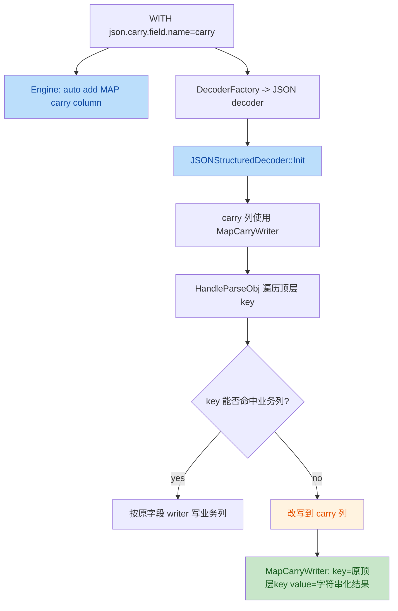

# `json.carry.field.name` 功能与实现梳理

## 1. 先说结论

`json.carry.field.name` 的目标是：把 **JSON 中未映射到 schema 业务列的字段**，兜底写入一个 `map<string,string>` 类型的 carry 列。

但按当前实现，使用前必须先接受下面这几个事实：

1. **只处理顶层未映射字段**
   - 不是 JSONPath 兜底，也不会递归把所有 nested unknown field 拆出来。

2. **当前每行只会保留第一个未映射顶层字段**
   - 如果同一条 JSON 里有多个未映射顶层 key，后续 key 会被跳过。
   - 这不是文档语义层面的“建议”，而是当前代码真实行为。

3. **carry 列里的 value 全部会被转成字符串**
   - 标量、array、object 最终都落成 `map<string,string>`。
   - object / array 会被“字符串化”后再写入，而不是保持结构化类型。

所以如果你的目标是：

- “保留所有未知字段，作为完整 side-car bag”：
  - **当前实现不太 ok**
- “给未知字段做一个轻量兜底观察位，容忍只保留第一个 key”：
  - **当前实现可用**

---

## 2. 配置长什么样

```sql
CREATE TABLE source(
  f VARCHAR
) WITH (
  'connector.type' = 'kafka',
  'connector.mode' = 'source',
  'format.type' = 'json',
  'json.carry.field.name' = 'carry'
);
```

### 2.1 SQL 层的一个重要细节

在 `CREATE TABLE source(...)` 走 SQL 建图时，engine 会根据 `json.carry.field.name` **自动补一列** `MAP` 类型字段到 schema 里。

代码位置：

- [engine.cpp](file:///root/Documents/stream_engine/src/sql/engine/engine.cpp#L419-L423)

也就是说：

- SQL 用户通常**不需要**显式在列定义里手写 `carry MAP<STRING,STRING>`；
- 但如果你直接在 C++ 里调用 decoder（例如单测），就需要自己把 carry 列加进 schema。

---

## 3. 流程图：代码改动/模块关系



涉及模块：

- SQL schema 自动补列： [engine.cpp](file:///root/Documents/stream_engine/src/sql/engine/engine.cpp#L419-L423)
- JSON decoder 读配置： [decoder.cpp](file:///root/Documents/stream_engine/src/sql/encdec/json/decoder.cpp#L23-L33)
- carry writer 安装点： [decoder.cpp](file:///root/Documents/stream_engine/src/sql/encdec/json/decoder.cpp#L211-L225)
- 顶层 unknown key 改写到 carry： [decoder.cpp](file:///root/Documents/stream_engine/src/sql/encdec/json/decoder.cpp#L1071-L1146)
- map 写入实现： [writer.cpp](file:///root/Documents/stream_engine/src/sql/encdec/writer.cpp#L1189-L1214)

---

## 4. 实现细节

### 4.1 配置如何进入 decoder

`json.carry.field.name` 在 `JSONStructuredDecoder::Create()` 中被读取，并传入构造函数：

- [decoder.cpp](file:///root/Documents/stream_engine/src/sql/encdec/json/decoder.cpp#L29-L33)
- [decoder.cpp](file:///root/Documents/stream_engine/src/sql/encdec/json/decoder.cpp#L49-L69)

配置常量定义：

- [format_options.h](file:///root/Documents/stream_engine/src/sql/encdec/options/format_options.h#L36)

### 4.2 carry 列是什么类型

初始化 writer 时，如果字段名等于 `m_carryFieldName`，decoder 不走普通字段 writer，而是给这列装一个 `MapCarryWriter<NamederRow&>`：

- [decoder.cpp](file:///root/Documents/stream_engine/src/sql/encdec/json/decoder.cpp#L211-L225)

它内部固定是：

- key writer: `utf8`
- value writer: `utf8`

所以 carry 的实际类型语义就是：

- `map<string, string>`

### 4.3 unknown key 怎么进入 carry

`HandleParseObj()` 遍历 JSON 顶层对象时：

1. 先用 `findColumn(e.key)` 查当前 key 是否命中 schema 业务列
2. 如果没命中，且配置了 carry 列：
   - 不再丢弃
   - 而是把目标列改成 `findColumn(m_carryFieldName)`

代码：

- [decoder.cpp](file:///root/Documents/stream_engine/src/sql/encdec/json/decoder.cpp#L1071-L1079)

随后会调用该列对应的 writer：

- [decoder.cpp](file:///root/Documents/stream_engine/src/sql/encdec/json/decoder.cpp#L1129-L1141)

因为 carry 列的 writer 是 `MapCarryWriter`，所以最终写入逻辑变成：

- map key = 原始顶层 unknown key
- map value = `get_string(val)` 的结果

### 4.4 value 是如何“字符串化”的

`MapCarryWriter::Write()`：

- [writer.cpp](file:///root/Documents/stream_engine/src/sql/encdec/writer.cpp#L1189-L1195)

其中 `value` 的字符串化逻辑在 `get_string()`：

- bool -> `std::to_string(...)`
- string -> 原字符串
- double -> `std::to_string(...)`
- int64 / uint64 -> `std::to_string(...)`
- array -> 递归转成字符串数组形式
- object -> 递归转成 JSON-like 字符串

代码：

- [writer.cpp](file:///root/Documents/stream_engine/src/sql/encdec/writer.cpp#L1131-L1187)

需要注意：

- 数值并不保证保留你原始 JSON 的字面量格式
- 比如 `1` 在当前实现下可能落成 `1.000000`（取决于 simdjson 的 number 类型分支）

---

## 5. 当前实现的关键限制

### 5.1 只会收顶层 unknown key

carry 的入口在 `HandleParseObj()` 的顶层 `for (const auto& e : resultObj)`：

- [decoder.cpp](file:///root/Documents/stream_engine/src/sql/encdec/json/decoder.cpp#L1071-L1146)

所以：

- `{"extra_obj":{"k":"v"}}` 会把 `extra_obj` 整个作为一个 key 写进 carry
- 但不会拆成：
  - `extra_obj.k -> v`

### 5.2 同一行只会保留第一个 unknown key

这是当前实现里最重要、也最容易误判的地方。

原因：

1. 第一个 unknown key 被路由到 carry 列
2. `row.WithIndex(idx)` + `MapCarryWriter::Write(...)` 后，这一列会被标记成“该行已写”
3. 后续 unknown key 再次落到同一个 carry 列时，会被 `row.AlreadyWriteField(idx)` 直接跳过

关键代码：

- 防重判断： [decoder.cpp](file:///root/Documents/stream_engine/src/sql/encdec/json/decoder.cpp#L1122-L1125)
- bitmap 定义： [decode_writer.h](file:///root/Documents/stream_engine/src/sql/encdec/decode_writer.h#L297-L305)

这意味着：

```json
{"f":"hello","extra_i":1,"extra_s":"x"}
```

当前只会留下一个 carry entry，不会把 `extra_i` 和 `extra_s` 都收进去。

### 5.3 ordering-fields 路径并没有专门的 carry 增强逻辑

`OrderingFieldsJSONStructuredDecoder` 会把 `JsonCarryFieldName` 传入基类：

- [ordering_fields_decoder.cpp](file:///root/Documents/stream_engine/src/sql/encdec/json/ordering_fields_decoder.cpp#L21)
- [ordering_fields_decoder.cpp](file:///root/Documents/stream_engine/src/sql/encdec/json/ordering_fields_decoder.cpp#L94-L101)

但它自己的快路径主要围绕列顺序优化，不像普通 `HandleParseObj()` 那样显式做“unknown key -> carry 列”的分支处理。

所以如果你要重点依赖 carry 语义，建议优先把注意力放在**普通 JSON decoder 路径**上验证，而不要默认 ordering-fields 行为与普通路径完全一致。

---

## 6. 什么时候可以用，什么时候不建议用

### 6.1 可以用

- 你只关心“是否出现了某个额外顶层字段”
- 你的输入通常只有一个主要 unknown key
- 你接受 carry 的 value 是字符串化结果

### 6.2 不建议直接依赖

- 你希望保留**所有**未知字段
- 你希望 carry 保持结构化 object/array，而不是字符串
- 你希望 nested unknown field 被递归展开收集

如果你的需求属于这类，建议把 `json.carry.field.name` 当成一个“弱兜底能力”，而不是完整的 unknown bag 方案。

---

## 7. 单元测试说明

这次补了 2 个直接验证当前行为的 case：

1. `JSONStructuredDecoderCarryFieldBasicTest`
   - 验证：
     - 已映射字段 `f` 正常写业务列
     - 未映射顶层字段会进入 carry
     - 当前实现只保留**第一个** unknown key
   - 文件： [json_decode_test.cpp](file:///root/Documents/stream_engine/src/test/plan/json_decode_test.cpp)

2. `JSONStructuredDecoderCarryFieldTopLevelOnlyTest`
   - 验证：
     - unknown object 会以整体字符串形式落到 carry
     - carry 不会把 nested key 拆开成多条
   - 文件： [json_decode_test.cpp](file:///root/Documents/stream_engine/src/test/plan/json_decode_test.cpp)

本地验证命令：

```bash
blade test //src/test:json_decode_test -- --gtest_filter=JsonDecodeTest.JSONStructuredDecoderCarryFieldBasicTest:JsonDecodeTest.JSONStructuredDecoderCarryFieldTopLevelOnlyTest
```

---

## 8. 建议

如果你现在就要在线上作业里用它，我的建议是：

1. 先把它当成“首个 unknown 顶层字段的兜底列”来使用，不要假设它能完整收集所有未知字段。
2. carry 列下游按 `map<string,string>` 读取，不要按结构化 JSON 语义读取。
3. 如果你的真实需求是“完整保留所有未知字段”，更适合考虑：
   - 直接保留 `json.raw.field`
   - 或后续专门实现一个“unknown fields bag”能力，而不是复用现在的 carry。

