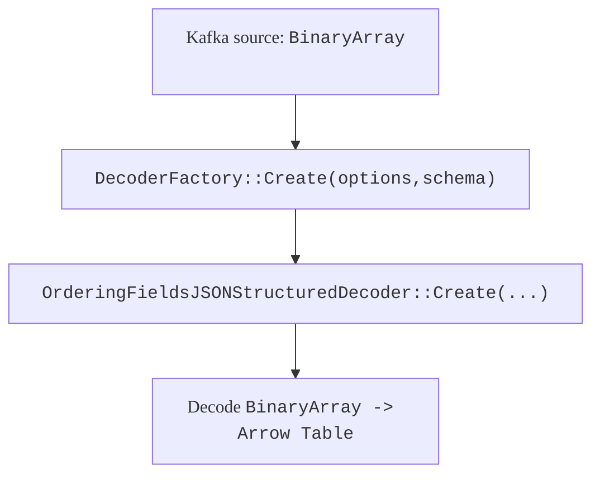

# JSON Decoder（`format.type=json`）配置与实现梳理

## 1. 适用范围

本文只覆盖 **Source table** 的 `WITH (...)` 里配置 `format.type=json` 时，Tide 如何把输入消息（通常是 Kafka message）解码成 `arrow::Table`，以及相关可用的 JSON decoder 配置项、实现细节与注意事项。

不覆盖：

- JSON encoder（`INSERT INTO sink ...` 时输出 JSON 的配置），相关代码见 `src/sql/encdec/json/encoder.*`

---

## 2. 总体流程（从 Source options 到 decoder）

当你在 `CREATE TABLE source (...) WITH (...)` 中设置：

- `'connector.type'='kafka'`
- `'connector.mode'='source'`
- `'format.type'='json'`

引擎会在 source 后插入 “BinaryArray -> Table” 的 decoder 映射算子：



关键代码位置：

- Source 建图时创建 decoder： [engine.cpp](file:///root/Documents/stream_engine/src/sql/engine/engine.cpp#L467-L513)
- decoder 选择入口： [decoder_factory.cpp](file:///root/Documents/stream_engine/src/sql/encdec/factory/decoder_factory.cpp#L24-L117)
- `format.type=json` 实际创建： [decoder_factory.cpp](file:///root/Documents/stream_engine/src/sql/encdec/factory/decoder_factory.cpp#L64-L69)
- Kafka 协议 source 自带 decoder 的路径（同样调用 `DecoderFactory::Create`）： [kafka_protocol_source.cpp](file:///root/Documents/stream_engine/src/source/mq/kafka_protocol_source.cpp#L95-L112)

---

## 3. JSON decoder 实现方案（两层）

`format.type=json` 的 Create 入口固定走：

- `OrderingFieldsJSONStructuredDecoder::Create(options, schema, fieldMap)`
  - 如果打开 ordering-fields 且 schema 类型可支持，则使用 **ordering-fields 快路径**
  - 否则回退到 **通用 JSONStructuredDecoder**

代码位置：

- 入口与分流逻辑： [ordering_fields_decoder.cpp](file:///root/Documents/stream_engine/src/sql/encdec/json/ordering_fields_decoder.cpp#L14-L88)

### 3.1 ordering-fields 快路径（可选）

启用条件：

- `json.ordering-fields.enabled=true`
- 且 `arrowx::canSupport(schema)` 为 true（否则自动回退）

实现要点：

- 使用 `simdjson` DOM 解析。
- 直接按 schema 构造列 builder（`arrowx::ArrayBuilder`），尽量避免逐字段查找。
- `safe-mode` 控制是否对 key 做对齐校验：
  - `safe-mode=true`：按 key->index 填充，缺字段补 null（更安全）
  - `safe-mode=false`：当且仅当 `result.size()==schema.size()` 时，按遍历顺序直接写列（更快但有错位风险）

代码位置：

- safe-mode 分支： [ordering_fields_decoder.cpp](file:///root/Documents/stream_engine/src/sql/encdec/json/ordering_fields_decoder.cpp#L177-L191)
- `decode(BinaryArray)` 快路径： [ordering_fields_decoder.cpp](file:///root/Documents/stream_engine/src/sql/encdec/json/ordering_fields_decoder.cpp#L231-L266)

### 3.2 通用 JSONStructuredDecoder（默认/回退）

实现要点：

- 主解析：`simdjson` DOM。
- 可选二级解析器：`rapidjson`（当 `UTF8_ERROR` 或开启 secondary-parser 且遇到部分 simdjson 错误时触发）。
- 按 `fields.mapping` 计算每列的 key path（`.` 分隔），逐字段写入 `decoder::NamederRow`，再由 `DecodeWriter` 构建 `arrow::Table`。

代码位置：

- WithMapping（`.` 拆路径）： [decoder.cpp](file:///root/Documents/stream_engine/src/sql/encdec/json/decoder.cpp#L225-L262)
- `json.field.path` 路径裁剪： [decoder.cpp](file:///root/Documents/stream_engine/src/sql/encdec/json/decoder.cpp#L528-L577)
- simdjson 解析失败回退 rapidjson： [decoder.cpp](file:///root/Documents/stream_engine/src/sql/encdec/json/decoder.cpp#L610-L658)

---

## 4. JSON Decoder 配置总表（全量）

说明：

- 这里的“全量”指 **`format.type=json` 这条 decoder 路径真实读取/生效的全部配置键**（含隐藏开关与环境变量）。
- 如果你要把**原始输入 JSON 文本保留到一列**，应使用 `json.raw.field`。
- `json.ordering-fields.row-mode-enabled` 只是“逐条消息解析”的执行模式开关，**不是**“把 JSON 存成一列”的配置。

| Key | 默认值 | 作用（精确语义） | 适用实现 | 代码引用 |
|---|---:|---|---|---|
| `format.type` | 无（必填） | 选择 decoder 类型，必须为 `json` 才会进入本文路径 | 所有 | [format.type check](file:///root/Documents/stream_engine/src/sql/encdec/factory/decoder_factory.cpp#L24-L33) |
| `fields.mapping` | 空 | 显式字段映射：`col:path;col2:path2`，`path` 用 `.` 分隔（不是 JSONPath） | 所有 | [parse fields.mapping](file:///root/Documents/stream_engine/src/sql/encdec/factory/decoder_factory.cpp#L34-L44)；[split by '.'](file:///root/Documents/stream_engine/src/sql/encdec/json/decoder.cpp#L225-L262) |
| `override.default.fields.mapping` | 空 | 当 `fields.mapping` 为空时：先用 schema 默认 `col->col`，再用该项覆盖部分映射 | 所有 | [default+override](file:///root/Documents/stream_engine/src/runtime/sqlparser/sql_parser.cpp#L82-L103)；[forward into decoder](file:///root/Documents/stream_engine/src/sql/encdec/json/ordering_fields_decoder.cpp#L43-L53) |
| `json.raw.field` | 空 | 将**原始输入 JSON 文本**存入 schema 指定列（通常为 `TEXT/VARCHAR`）；不受 `json.field.path` 影响 | JSONStructuredDecoder + OrderingFieldsJSONStructuredDecoder | [read json.raw.field](file:///root/Documents/stream_engine/src/sql/encdec/json/decoder.cpp#L23-L64)；[validate raw field type](file:///root/Documents/stream_engine/src/sql/encdec/json/decoder.cpp#L130-L142)；[write raw per row](file:///root/Documents/stream_engine/src/sql/encdec/json/decoder.cpp#L652-L652)；[write raw (stream path)](file:///root/Documents/stream_engine/src/sql/encdec/json/decoder.cpp#L619-L619)；[unnest rows write raw](file:///root/Documents/stream_engine/src/sql/encdec/json/decoder.cpp#L1033-L1033)；[ordering-fields append raw](file:///root/Documents/stream_engine/src/sql/encdec/json/ordering_fields_decoder.cpp#L28-L44) |
| `json.field.path` | 空 | 先按 `.` 路径下钻；若最终值是 object 则直接解；若是 string 则把 string 当 JSON 再 parse；若路径不存在则丢弃该消息（不产出行） | JSONStructuredDecoder（也影响 unnest 子逻辑） | [checkJsonStrPath](file:///root/Documents/stream_engine/src/sql/encdec/json/decoder.cpp#L528-L577)；[skip row](file:///root/Documents/stream_engine/src/sql/encdec/json/decoder.cpp#L598-L600)；[unnest string path](file:///root/Documents/stream_engine/src/sql/encdec/json/decoder.cpp#L833-L851) |
| `json.try.secondary.parser` | `false` | 允许在部分 simdjson 解析错误时回退 rapidjson；默认仅对 `TAPE_ERROR` / `UNESCAPED_CHARS` 这类“结构仍可能可恢复”的错误有意义 | JSONStructuredDecoder | [secondary parser trigger](file:///root/Documents/stream_engine/src/sql/encdec/json/decoder.cpp#L634-L651) |
| `json.invalid.utf8.fallback.enabled` | `true` | 控制 `simdjson::UTF8_ERROR` 是否继续回退 rapidjson。设为 `false` 时，含非法 UTF-8 的消息直接丢弃该行，不再走 rapidjson。推荐在“非法 UTF-8 代表脏数据/坏输入”场景关闭，以避免把本该失败的数据静默吞进结果表。 | JSONStructuredDecoder | [utf8 fallback gate](file:///root/Documents/stream_engine/src/sql/encdec/json/decoder.cpp#L671-L688)；[field-path utf8 gate](file:///root/Documents/stream_engine/src/sql/encdec/json/decoder.cpp#L823-L845) |
| `json.unescape.fields` | 空 | 仅在 rapidjson 回退路径下用于控制 string 字段的额外 escape 行为；`*` 表示全部字段 | JSONStructuredDecoder | [pre-calc idx](file:///root/Documents/stream_engine/src/sql/encdec/json/decoder.cpp#L169-L183)；[escape usage](file:///root/Documents/stream_engine/src/sql/encdec/json/decoder.cpp#L1221-L1230) |
| `json.print.error` | `true` | 控制部分错误打印（例如写入失败样本/错误信息） | 两条路径都会读，但主要影响 JSONStructuredDecoder 的打印点 | [read option](file:///root/Documents/stream_engine/src/sql/encdec/json/ordering_fields_decoder.cpp#L26-L53)；[print_error_ usage](file:///root/Documents/stream_engine/src/sql/encdec/json/decoder.cpp#L1088-L1099) |
| `json.carry.field.name` | 空 | 开启 carry：把未映射顶层字段写入一个 schema 中的同名列（需要类型匹配 writer，常见为 `map<string,string>`） | JSONStructuredDecoder | [create MapCarryWriter](file:///root/Documents/stream_engine/src/sql/encdec/json/decoder.cpp#L192-L206)；[carry fallback](file:///root/Documents/stream_engine/src/sql/encdec/json/decoder.cpp#L1031-L1038) |
| `json.mode.unnest` | `false` | 展开模式：允许 array/object 展开，可能让一条消息产出多行（取决于字段与 schema） | JSONStructuredDecoder | [enable unnest](file:///root/Documents/stream_engine/src/sql/encdec/json/decoder.cpp#L82-L85)；[unnest main](file:///root/Documents/stream_engine/src/sql/encdec/json/decoder.cpp#L589-L597) |
| `json.unnest.fields` | 空 | 指定哪些字段采用“行级展开”的索引推进策略（`;` 分隔） | JSONStructuredDecoder | [init fields idx](file:///root/Documents/stream_engine/src/sql/encdec/json/decoder.cpp#L85-L87)；[array idx advance](file:///root/Documents/stream_engine/src/sql/encdec/json/decoder.cpp#L868-L890) |
| `json.unnest.joinkey.char` | `.` | 展开后 key 拼接分隔符（如 `a.b`），影响 schema 列名匹配 | JSONStructuredDecoder | [read join key](file:///root/Documents/stream_engine/src/sql/encdec/json/decoder.cpp#L31-L32)；[compose new key](file:///root/Documents/stream_engine/src/sql/encdec/json/decoder.cpp#L967-L969) |
| `json.cmp.lower` | 空（视为 false） | key 比较转小写（主要在 unnest 写 key 时生效） | JSONStructuredDecoder | [lower_ apply](file:///root/Documents/stream_engine/src/sql/encdec/json/decoder.cpp#L963-L967) |
| `json.ordering-fields.enabled` | `false` | 启用 ordering-fields 快路径（不满足 schema 支持会回退） | OrderingFieldsJSONStructuredDecoder | [read+branch](file:///root/Documents/stream_engine/src/sql/encdec/json/ordering_fields_decoder.cpp#L27-L58) |
| `json.ordering-fields.safe-mode-enabled` | `true` | safe-mode：key->index 填充并补 null；关闭后在 “字段数相等” 时按遍历顺序写列，存在错位风险 | OrderingFieldsJSONStructuredDecoder | [safe parser](file:///root/Documents/stream_engine/src/sql/encdec/json/ordering_fields_decoder.cpp#L177-L191) |
| `json.ordering-fields.row-mode-enabled` | `false` | 逐条消息解析模式：开启后对每条输入消息单独 `parse(...)`；关闭时走 `parse_many` 尝试批量解析连续 buffer。该配置**不负责**把原始 JSON 存入一列，保留原文请使用 `json.raw.field` | OrderingFieldsJSONStructuredDecoder | [rowMode_ branch](file:///root/Documents/stream_engine/src/sql/encdec/json/ordering_fields_decoder.cpp#L250-L258)；[parse_many path](file:///root/Documents/stream_engine/src/sql/encdec/json/ordering_fields_decoder.cpp#L261-L285) |
| `jsondecoder.verify.outputtable` | `false` | 开启输出表校验；失败会把样本写入 fails log 并返回空表 | JSONStructuredDecoder | [read option](file:///root/Documents/stream_engine/src/sql/encdec/json/decoder.cpp#L43-L46)；[verify usage](file:///root/Documents/stream_engine/src/sql/encdec/json/decoder.cpp#L335-L339) |
| `JSON_DECODER_MAX_SIMDJSON_PROCESS_SIZE` | `4GB` | 环境变量：限制单次 simdjson 处理的累计字节规模（影响批处理切分） | JSONStructuredDecoder | [env read](file:///root/Documents/stream_engine/src/sql/encdec/json/decoder.cpp#L89-L92) |
| `JSON_DECODER_MAX_SIMDJSON_PROCESS_ROW_NUM` | `1024` | 环境变量：限制单次 simdjson 处理的累计行数（影响批处理切分） | JSONStructuredDecoder | [env read](file:///root/Documents/stream_engine/src/sql/encdec/json/decoder.cpp#L93-L96) |

---

## 6. 推荐配置模板（Kafka + JSON）

### 6.1 你的例子（key 与列名一致）

如果 Kafka 消息就是形如：

```json
{"conninfo_time_stamp":123, "conninfo_domain_str":"xx", "...": "..."}
```

那么可以只配：

```sql
CREATE TABLE source(...) WITH (
  'connector.type' = 'kafka',
  'connector.mode' = 'source',
  'format.type' = 'json',
  -- 将原始输入 JSON 文本写入 schema 中名为 raw 的列（列类型建议 TEXT/VARCHAR）
  'json.raw.field' = 'raw',
  'json.ordering-fields.enabled' = 'true',
  'json.ordering-fields.safe-mode-enabled' = 'true',
  'json.ordering-fields.row-mode-enabled' = 'true'
);
```

说明：

- 不写 `fields.mapping` 时，decoder 会使用 schema 的默认映射 `col->col`（见 [sql_parser.cpp](file:///root/Documents/stream_engine/src/runtime/sqlparser/sql_parser.cpp#L82-L103) 和 [decoder_factory.cpp](file:///root/Documents/stream_engine/src/sql/encdec/factory/decoder_factory.cpp#L64-L69)）。
- `json.raw.field` 用于把**原始输入 JSON 文本**写进 `raw` 列。
- `json.ordering-fields.row-mode-enabled` 只是逐条消息解析模式，和是否保留 `raw` 列是两个独立概念。

### 6.2 JSON 有外层包裹（需要 `json.field.path`）

如果消息是：

```json
{"data": {"conninfo_time_stamp":123, "conninfo_domain_str":"xx"}}
```

则增加：

```sql
'json.field.path' = 'data'
```

注意：如果某些消息没有 `data` 字段，这些消息会被跳过（不输出行）。

---

## 7. 注意事项（踩坑清单）

1. `json.field.path` 缺失时会跳过行，而不是填充 null 行：见 [decoder.cpp](file:///root/Documents/stream_engine/src/sql/encdec/json/decoder.cpp#L598-L600)。
2. key 路径分隔符固定为 `.`，JSON key 含 `.` 的场景无法直接映射：见 [decoder.cpp](file:///root/Documents/stream_engine/src/sql/encdec/json/decoder.cpp#L237-L240)。
3. 开启 `json.try.secondary.parser=true` 时，遇到部分错误会回退 rapidjson，并可能把样本写到 `/tmp`，在容器/沙箱环境可能引发权限或磁盘问题：见 [decoder.cpp](file:///root/Documents/stream_engine/src/sql/encdec/json/decoder.cpp#L639-L649)。
4. 如果业务上把非法 UTF-8 视为明确的坏输入，建议同时配置 `json.invalid.utf8.fallback.enabled=false`。原因是 invalid UTF-8 通常不是“宽松解析可接受的小偏差”，而是源数据编码已经损坏；继续回退 rapidjson 只会把坏数据静默混入下游结果。
5. `json.ordering-fields.safe-mode-enabled=false` 有列错位风险（仅在字段数量完全一致且顺序稳定时考虑）：见 [ordering_fields_decoder.cpp](file:///root/Documents/stream_engine/src/sql/encdec/json/ordering_fields_decoder.cpp#L179-L191)。
6. carry 字段只覆盖顶层未知 key，并且要求 schema 的 carry 列类型匹配写入方式：见 [decoder.cpp](file:///root/Documents/stream_engine/src/sql/encdec/json/decoder.cpp#L192-L206)。
