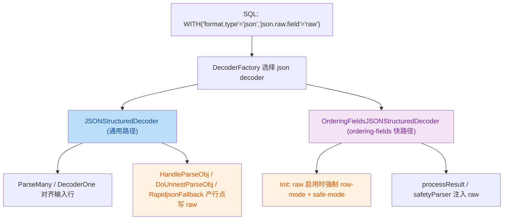
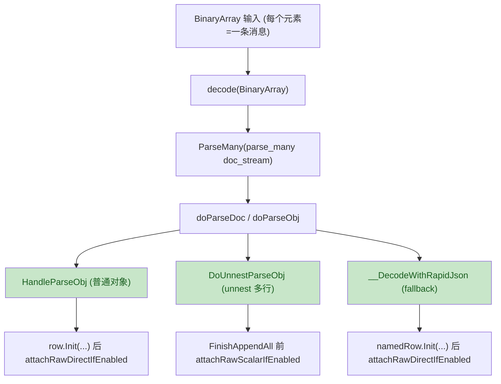
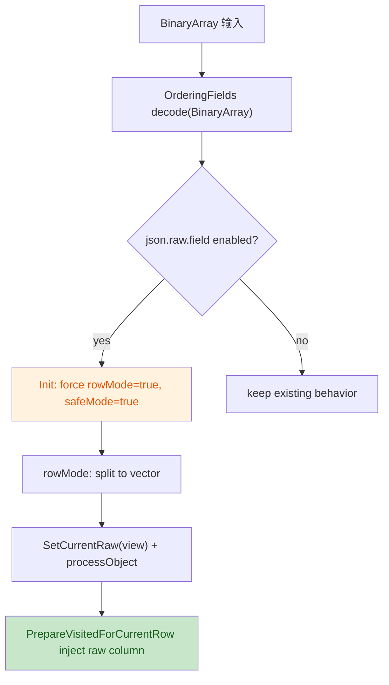

# `json.raw.field` 功能实现流程与注意事项

## 1. 目标与语义

`json.raw.field` 用于把**输入消息的原始 JSON 文本**保存在输出表的一列中（列类型必须是 `STRING/utf8`），便于：

- 排障（保留原始 payload）
- 回灌/重放
- 下游需要同时拿结构化字段 + 原文

语义约束（当前实现）：

- raw 列写入的是**原始输入整条 JSON 文本**，不受 `json.field.path` 裁剪影响。
- raw 写入不改变“是否产行”的旧语义：如果解码结果在业务字段上是 empty（无匹配字段，按原逻辑会丢行），raw **不会强行把这行留下**。

---

## 2. 配置与使用方式

### 2.1 SQL 示例

schema 中添加 `raw` 列：

```sql
CREATE TABLE source(
  f VARCHAR,
  raw VARCHAR
) WITH (
  'connector.type' = 'kafka',
  'connector.mode' = 'source',
  'format.type' = 'json',
  'json.raw.field' = 'raw'
);
```

### 2.2 schema 约束

- `json.raw.field` 指定的列名必须存在于 schema 中。
- 类型必须为 `STRING/utf8`（否则 init 失败）。

代码位置：

- `JSONStructuredDecoder::Init()` 检查： [decoder.cpp](file:///root/Documents/stream_engine/src/sql/encdec/json/decoder.cpp#L130-L142)
- `OrderingFieldsJSONStructuredDecoder::Init()` 检查： [ordering_fields_decoder.cpp](file:///root/Documents/stream_engine/src/sql/encdec/json/ordering_fields_decoder.cpp#L116-L138)

---

## 3. 改动涉及模块（哪里被改了）



涉及文件：

- 配置 key： [format_options.h](file:///root/Documents/stream_engine/src/sql/encdec/options/format_options.h)
- 通用 JSON decoder： [decoder.h](file:///root/Documents/stream_engine/src/sql/encdec/json/decoder.h)、[decoder.cpp](file:///root/Documents/stream_engine/src/sql/encdec/json/decoder.cpp)
- ordering-fields JSON decoder： [ordering_fields_decoder.h](file:///root/Documents/stream_engine/src/sql/encdec/json/ordering_fields_decoder.h)、[ordering_fields_decoder.cpp](file:///root/Documents/stream_engine/src/sql/encdec/json/ordering_fields_decoder.cpp)
- 单测： [json_decode_test.cpp](file:///root/Documents/stream_engine/src/test/plan/json_decode_test.cpp)

---

## 4. 核心实现流程（数据流角度）

### 4.1 通用路径（JSONStructuredDecoder）

关键点：raw 的写入要跟**最终产出的每一行**严格对齐，所以写入点必须选在“产行点”，而不能只在入口处写一次。



代码落点：

- `ParseMany` 处理 null 行对齐（避免 null 吞 doc）： [decoder.cpp](file:///root/Documents/stream_engine/src/sql/encdec/json/decoder.cpp#L500-L523)
- 普通对象产行 + raw 写入： [HandleParseObj](file:///root/Documents/stream_engine/src/sql/encdec/json/decoder.cpp#L1056-L1067)
- unnest 产行 + raw 写入： [DoUnnestParseObj](file:///root/Documents/stream_engine/src/sql/encdec/json/decoder.cpp#L1026-L1053)
- rapidjson fallback 产行 + raw 写入： [__DecodeWithRapidJson](file:///root/Documents/stream_engine/src/sql/encdec/json/decoder.cpp#L1147-L1207)
- helper（直写 vs scalar 写）： [decoder.h](file:///root/Documents/stream_engine/src/sql/encdec/json/decoder.h#L40-L75)

### 4.2 ordering-fields 路径（OrderingFieldsJSONStructuredDecoder）

ordering-fields 原本为了性能会走 `parse_many` 批处理（doc_stream 数量可能与 input 行数不一致），而 raw 必须一一对齐输入行。

因此实现选择是：启用 `json.raw.field` 时强制进入 “row-mode + safe-mode”。



代码落点：

- 强制 row-mode/safe-mode： [ordering_fields_decoder.cpp](file:///root/Documents/stream_engine/src/sql/encdec/json/ordering_fields_decoder.cpp#L116-L138)
- raw 注入：`PrepareVisitedForCurrentRow()`： [ordering_fields_decoder.h](file:///root/Documents/stream_engine/src/sql/encdec/json/ordering_fields_decoder.h#L40-L52)

---

## 5. 注意事项（必须理解的坑）

1. `NamederRow::Finish()` 与 `FinishAppendAll()` 行为不同
   - `Write<true>` 会写 scalar，需要 `FinishAppendAll()` 才会 flush。
   - 普通路径走 `Finish()`，所以 raw 需要用 direct 写法；unnest 走 `FinishAppendAll()`，raw 必须配套写 scalar。
   - 相关 helper： [decoder.h](file:///root/Documents/stream_engine/src/sql/encdec/json/decoder.h#L40-L62)

2. `ParseMany` 的 doc_stream 与 input 行必须对齐
   - 旧问题：null 行会“吞掉”一个 doc，导致错位/丢数据。
   - 当前修复：在消费 doc 前先把 null 行写成全 NULL 行（不消耗 doc）。
   - 代码： [decoder.cpp](file:///root/Documents/stream_engine/src/sql/encdec/json/decoder.cpp#L500-L523)

3. ordering-fields + raw 的语义会收紧
   - 启用 raw 时强制 `rowMode=true` / `safeMode=true`，牺牲一部分性能来换取对齐与正确性。
   - 代码： [ordering_fields_decoder.cpp](file:///root/Documents/stream_engine/src/sql/encdec/json/ordering_fields_decoder.cpp#L116-L138)

4. raw 不改变“是否产行”的旧语义
   - 目前 raw 仅在 `!Empty()` 时写入（保持旧语义：无匹配字段则丢行）。
   - 如果未来希望“只要 raw 有值就保留行”，需要重新定义 Empty 语义并同步下游预期（属于 breaking change）。
