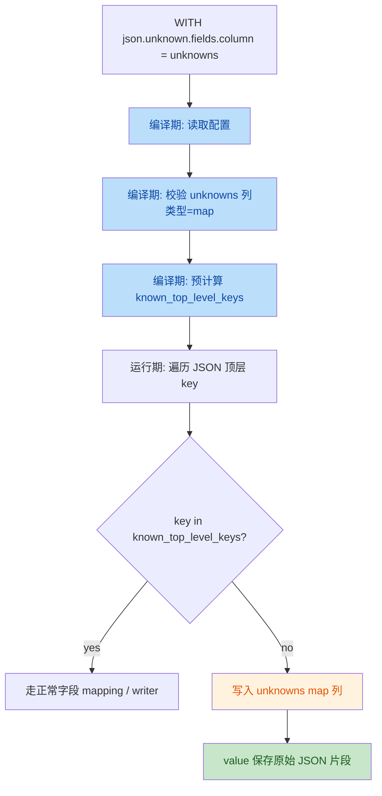

# `json.unknown.fields.column` 设计方案与实现计划

## 1. 背景

现有 `json.carry.field.name` 的名字容易让人理解成：

- “把所有未映射字段兜底收集起来”
- “可以作为完整 unknown fields bag 使用”

但按当前实现，它并不满足这个语义：

- 只看**顶层** unknown key
- 同一行当前只保留**第一个** unknown key
- value 会被字符串化

因此，如果继续复用 `json.carry.field.name` 扩展语义，会和存量场景形成冲突，也会让用户更难判断真实行为。

所以这里建议定义一个**全新的、语义单一且不与存量冲突**的 option：

```text
json.unknown.fields.column
```

---

## 2. 目标

### 2.1 语义定义

`json.unknown.fields.column=<col_name>` 的语义定义为：

- 当输入 JSON 中出现**顶层 key**
- 且该 key **不属于当前 decoder 已知字段集合**
  - 这里的“已知字段”指：
    - schema 业务列对应的 mapping 顶层 key
    - 不包含 `json.unknown.fields.column` 自身指向的 map 列
- 则把该 key/value 写入配置指定的 **map<string,string>** 列中

value 的定义：

- 保存该字段对应的**原始 JSON 片段**
- 不是“解释后再 stringify 的业务值”
- 例如：

```json
{"a":1,"b":"x","c":{"k":1},"d":[1,2]}
```

unknown 写入 map 后的 value 应当是：

- `a -> 1`
- `b -> "x"`
- `c -> {"k":1}`
- `d -> [1,2]`

注意：

- 当前设计仅覆盖**顶层 key**
- 不递归展开 nested unknown field

### 2.2 设计目标

1. **名字语义明确**
   - 一看就知道这是“unknown fields 写到某一列”

2. **与存量 `json.carry.field.name` 完全隔离**
   - 不复用旧语义，不做兼容增强，不影响已有作业

3. **编译期完备检查**
   - 能在 DAG/build 阶段发现 schema、类型、冲突配置等问题

4. **运行期高效**
   - 不做重复 `findColumn(carry_col)` 查找
   - 不做额外路径解析
   - 只在 unknown key 命中时追加一次 map entry

---

## 3. 命名方案

推荐采用：

```text
json.unknown.fields.column
```

选择这个名字的原因：

- `json.` 前缀和现有 JSON 选项体系一致
- `unknown.fields` 明确表达“多余字段/未知字段”
- `column` 明确表达它配置的是“目标列名”

不建议的名字：

- `json.extra.fields.column`
  - “extra” 比 “unknown” 更弱，容易和业务扩展字段语义混淆
- `json.carry.*`
  - 会和现有 `json.carry.field.name` 语义纠缠

---

## 4. 与现有 option 的关系

### 4.1 与 `json.carry.field.name`

建议：

- **共存**
- **不兼容复用**
- **不共享实现语义**

关系表：

| option | 目标语义 | 当前/计划行为 |
|---|---|---|
| `json.carry.field.name` | 历史遗留兜底字段 | 保持现状，不改语义 |
| `json.unknown.fields.column` | 完整收集顶层 unknown key/value 到 map 列 | 新实现，语义明确 |

### 4.2 与 `json.raw.field`

- `json.raw.field` 保存整条原始输入 JSON
- `json.unknown.fields.column` 只保存 unknown 顶层字段的局部 JSON 片段

二者可以共存：

- `json.raw.field` 用于完整保留原始消息
- `json.unknown.fields.column` 用于便捷消费 unknown top-level fields

---

## 5. 编译期与运行期分工

用户特别强调了“两阶段算子开发”：

- 编译期：可以检查、耗时、完备
- 运行期：一定要高效、简洁

这里设计也按这个原则拆开。

## 5.1 编译期职责

编译期建议在以下位置完成检查和预计算：

- SQL schema 构建： [engine.cpp](file:///root/Documents/stream_engine/src/sql/engine/engine.cpp#L406-L424)
- decoder 构建： [decoder_factory.cpp](file:///root/Documents/stream_engine/src/sql/encdec/factory/decoder_factory.cpp#L24-L69)
- decoder `Init()`： [decoder.cpp](file:///root/Documents/stream_engine/src/sql/encdec/json/decoder.cpp#L124-L226)

编译期需要完成：

1. **读取并注册新配置**
   - `JsonUnknownFieldsColumn = "json.unknown.fields.column"`

2. **schema 检查**
   - 指定列必须存在
   - 类型必须是 `map<string,string>`
   - 如果走 SQL source 建图，也可比照 `json.carry.field.name` 自动补列

3. **冲突检查**
   - 不允许与 `json.carry.field.name` 指向同一列
   - 不允许与普通业务映射列重名
   - 如同时配置两者，建议直接报错，而不是模糊合并

4. **预计算“已知顶层 key 集合”**
   - 根据 `fieldMap` 计算每个业务列 mapping 的**顶层 path segment**
   - 例如：
     - `a.b.c` -> 已知顶层 key 是 `a`
     - `user.id` -> 已知顶层 key 是 `user`
   - 生成：
     - `known_top_level_keys`
   - 同时预计算：
     - `unknown_fields_column_index`

5. **writer 绑定**
   - 为 unknown-fields 列安装一个新的 writer，推荐单独实现：
     - `MapUnknownFieldsWriter`
   - 不复用 `MapCarryWriter`

### 5.2 运行期职责

运行期要尽量只做以下事情：

1. 遍历顶层 object 时拿到 `e.key`
2. O(1) / O(logN) 判断它是否属于 `known_top_level_keys`
3. 如果不是：
   - 直接把 `e.key` 和该 `e.value` 的**原始 JSON 片段**写入 map 列
4. 如果是：
   - 走原有正常业务列写入流程

运行期不应再做：

- 再次 `findColumn(unknown_col_name)`
- 再次推导 mapping 顶层 key
- 模糊兼容 `carry` 旧语义

---

## 6. 数据流图



---

## 7. 关键实现建议

### 7.1 不要直接在 `HandleParseObj()` 里复用现有 carry 分支

现有 `HandleParseObj()` 中 unknown key 的处理逻辑是：

- [decoder.cpp](file:///root/Documents/stream_engine/src/sql/encdec/json/decoder.cpp#L1071-L1146)

它的问题：

- unknown key 被“重定向”到一个普通列索引
- 然后受 `row.AlreadyWriteField(idx)` 约束
- 导致同一行只会保留第一个 unknown key

新方案不应该沿用这条路径。

### 7.2 建议新加单独分支

建议在 `HandleParseObj()` 里改成两个逻辑通道：

1. **known key 通道**
   - 和现有字段 mapping 逻辑一致

2. **unknown key 通道**
   - 直接命中 `unknown_fields_column_index`
   - 调用 `MapUnknownFieldsWriter`
   - 该 writer 支持同一行多次 append entry
   - 不受 `AlreadyWriteField(idx)` 限制

### 7.3 value 必须保存原始 JSON 片段

不要沿用现在 `MapCarryWriter::get_string()` 的字符串化方式：

- [writer.cpp](file:///root/Documents/stream_engine/src/sql/encdec/writer.cpp#L1131-L1187)

原因：

- `1` 可能变成 `1.000000`
- object/array 片段格式会被重建，而不是保留输入 JSON 的原始片段

新 writer 应该优先使用：

- `arrowx::formatElement(...)` 或等价能力，输出标准 JSON 文本
- 或者如果 simdjson/rapidjson 路径能提供原始 slice，则优先保留原始 slice

如果“完全原样 slice”实现成本高，第一版也可以先定义为：

- “规范化后的 JSON 片段”

但文档必须写清楚，不要模糊成“原样输入字节”。

---

## 8. ordering-fields 路径建议

`ordering-fields` 是性能快路径，目标是按 schema 顺序写列。

对于 `json.unknown.fields.column`，有两个可选方案：

### 方案 A：第一版直接禁用快路径

只要配置了 `json.unknown.fields.column`：

- 直接回退到普通 `JSONStructuredDecoder`

优点：

- 语义简单
- 运行期不用在快路径里混入 unknown 逻辑
- 第一版最稳

缺点：

- 启用该功能时吞掉 ordering-fields 的性能收益

### 方案 B：快路径补充 unknown 分支

在 ordering-fields 遍历顶层 key 时：

- 如果 key 不在 schema known set 里
- 直接追加到 unknown map writer

优点：

- 保留快路径性能

缺点：

- 侵入 ordering-fields 逻辑
- 需要更仔细处理列对齐和 map builder 生命周期

**建议第一版采用方案 A。**

原因：

- 用户已经强调“运行期高效、简洁”
- 第一版最重要的是语义正确且不与存量冲突
- 先让普通路径正确落地，再决定是否为 ordering-fields 单独优化

---

## 9. 单元测试计划

建议第一版至少覆盖这 6 类 case：

1. **基础功能**
   - 一个 known key + 两个 unknown top-level key
   - 断言 unknown map 列里保留全部两个 key

2. **value 原始 JSON 片段**
   - 标量 `1` / `"x"` / `true`
   - 断言 value 是 `1` / `"x"` / `true` 对应约定格式

3. **object / array value**
   - 断言保留完整 JSON 片段，不被错误拆平

4. **与 fields.mapping 共存**
   - 例如 `f -> data.f`
   - 顶层 `data` 属于 known key，不应被误判为 unknown

5. **与 json.raw.field 共存**
   - 同时配置时：
     - raw 列保留整条输入
     - unknown map 列只保留 unknown top-level fields

6. **冲突与非法配置**
   - unknown 列不存在
   - unknown 列类型不是 `map<string,string>`
   - 同时配置 `json.carry.field.name` 和 `json.unknown.fields.column`

如果第一版选择“配置新 option 时回退普通 decoder”，还应补 1 个 case：

7. **ordering-fields 自动回退**
   - 即使打开 `json.ordering-fields.enabled=true`
   - 配置了 `json.unknown.fields.column` 后也走普通 decoder

---

## 10. 分阶段实施计划

### Phase 1：定义与护栏

- 新增配置常量：
  - `json.unknown.fields.column`
- 文档声明：
  - 与 `json.carry.field.name` 语义完全不同
- 编译期校验：
  - 列存在 / 类型正确 / 冲突配置报错

### Phase 2：普通 JSON decoder 实现

- 在 `JSONStructuredDecoder::Init()` 中：
  - 预计算 `unknown_fields_column_index`
  - 预计算 `known_top_level_keys`
- 在 `HandleParseObj()` 中：
  - unknown key 走独立 writer 分支
  - 同一行支持多次 append

### Phase 3：测试与文档

- 补齐 6~7 个单测
- 在 `docs/codec/` 下写使用说明和限制说明

### Phase 4：性能优化（可选）

- 评估 ordering-fields 是否需要支持该功能
- 如果需要，再为快路径单独设计 unknown map writer 注入点

---

## 11. 最终建议

我建议把这个新 option 定义成：

```text
json.unknown.fields.column
```

并明确第一版语义为：

- 仅顶层
- map<string,string>
- 收集全部 unknown top-level key
- value 保存 JSON 片段
- 与 `json.carry.field.name` 不共享实现，不做兼容扩展
- 第一版启用时优先回退普通 decoder，保证正确性和运行期简洁

这是当前最清晰、最不容易和存量语义打架的方案。

