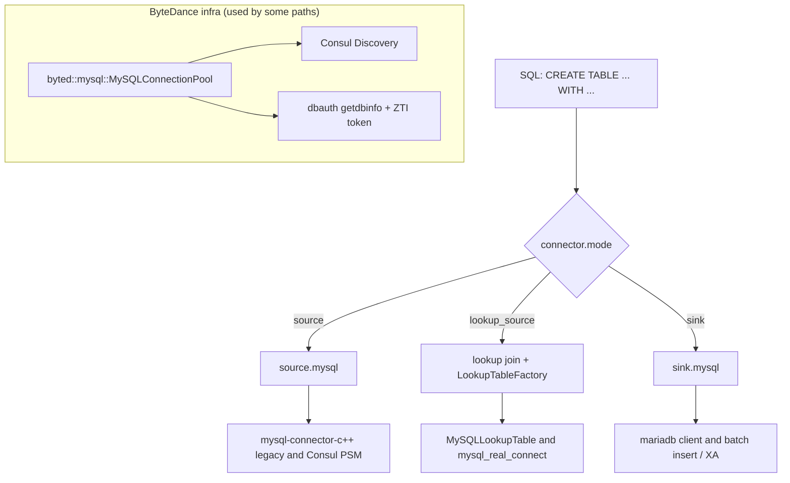
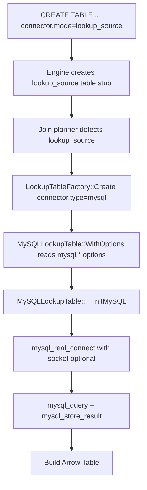
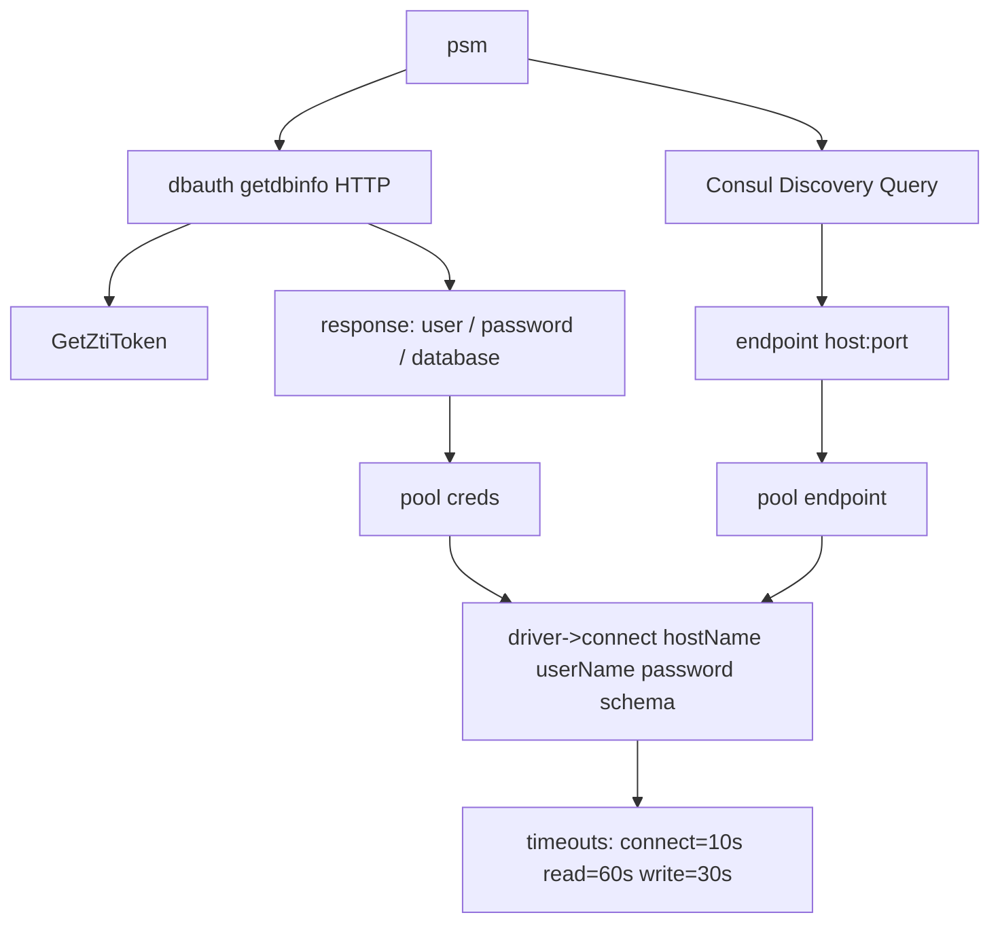

# 项目 MySQL 访问梳理

## 结论先看



> 说明：之前 Mermaid 渲染失败的根因是节点 label 里包含 `(...)`、`socket?` 等符号；在部分 Mermaid 解析器/版本里会被当作“形状语法 token”触发 parse error。

这个项目访问 MySQL 主要有 4 条路径：

1. `source.mysql`
   - 用于把一次 SQL 查询结果读成一个文本块。
   - 代码入口：`src/source/mysql_source.cpp`
   - 特点：通过 PSM 做服务发现，但账号密码仍由调用方显式传入。

2. `sink.mysql`
   - 用于把 `arrow::Table` 批量写入 MySQL。
   - 代码入口：`src/sink/mysql_sink.cpp`
   - 特点：直接走 MariaDB C client，支持普通自动提交和 XA 事务两种模式。

3. `lookup mysql`
   - 用于 SQL lookup join 的维表加载。
   - 代码入口：`src/sql/join/lookup/mysql_lookup_table.cpp`
   - 特点：按 schema 拼 `SELECT`，支持 filter pushdown。

4. `collection` 模块里的 MySQL prepare / 全局 QPS 表
   - 用于数据采集前的 prepare 查询，以及字节内部的 QPS 协调表读写。
   - 代码入口：`src/source/collection/model/config.cpp`、`src/source/collection/model/global_config.cpp`
   - 特点：大量依赖字节内部基础设施，核心是 `util/mysql_pool` 里的动态鉴权连接池。

项目底层实际上用了两套 MySQL 客户端：

- `mysql-connector-c++ legacy`
  - 用在 `source.mysql`、`collection prepare`、QPS 表访问、`lookup mysql`
  - 依赖定义见 `src/BUILD` 中的 `mysqlcppconn`
- `mariadb-connector-c`
  - 用在 `sink.mysql`、`lookup mysql`
  - 依赖定义见 `src/BUILD` 中的 `mariadbclient`

---

## 1. 入口注册位置

MySQL 相关算子/连接器的注册点都在 `src/runtime/taskmanager/operator_func_factory.cpp`：

- `source.mysql`
- `sink.mysql`
- `table.lookup.join` + `connector.type=mysql`

对应实现文件：

- `src/source/mysql_source.cpp`
- `src/sink/mysql_sink.cpp`
- `src/sql/join/lookup/mysql_lookup_table.cpp`

代码链接：

- [operator_func_factory.cpp](file:///root/Documents/stream_engine/src/runtime/taskmanager/operator_func_factory.cpp#L2153-L2232)

---

## 2. `source.mysql`

### 2.1 用途

`source.mysql` 是一个非流式 source。它执行一条 SQL，把结果按“空格分列、换行分行”的方式拼成字符串，写入内部缓冲区。

### 2.2 配置项

定义位置：`src/source/mysql_source.cpp`

- `mysql.psm`
- `mysql.user`
- `mysql.password`
- `mysql.command`

### 2.3 访问流程

1. 根据 `mysql.psm` 用 Consul 做服务发现。
2. 随机挑一个 endpoint。
3. 用 `mysql.user` / `mysql.password` 连接。
4. 执行 `mysql.command`。
5. 把 `ResultSet` 每列转成字符串，拼到 `m_data`。

### 2.4 代码位置

- 参数解析/建连/执行： [mysql_source.cpp](file:///root/Documents/stream_engine/src/source/mysql_source.cpp#L14-L99)
- 算子注册： [operator_func_factory.cpp](file:///root/Documents/stream_engine/src/runtime/taskmanager/operator_func_factory.cpp#L2158-L2162)

### 2.5 最小示例

下面是按实现推导出的最小配置示例，不是仓库内现成 demo：

```ini
opname=source.mysql
mysql.psm=toutiao.mysql.demo_read
mysql.user=demo_user
mysql.password=demo_pass
mysql.command=SELECT id, name FROM demo_table LIMIT 10
```

### 2.6 需要注意

- 它没有单独的 `mysql.database` 选项，SQL 里通常要自己写完整表名，或者依赖服务端默认 schema。
- 输出是“纯文本拼接结果”，不是结构化 `arrow::Table`。
- 这里虽然用了 PSM 做服务发现，但账号密码不是动态鉴权拿到的，而是调用方直接传入。

---

## 3. `sink.mysql`

### 3.1 用途

`sink.mysql` 把 `arrow::Table` 批量写入 MySQL。

### 3.2 配置项

定义位置：`src/sink/mysql_sink.cpp`

- `mysql.host`
- `mysql.port`
- `mysql.username`
- `mysql.password`
- `mysql.database`
- `mysql.table`
- `mysql.socket`
- `mysql.batch.size`
- `mysql.auto.commit`
- `mysql.max.retry`

默认值：

- `host=localhost`
- `port=3306`
- `database=test`
- `table=test`
- `batch.size=100`
- `auto.commit=true`
- `max.retry=3`

### 3.3 访问流程

1. `Init()` 读取配置并创建 MySQL client。
2. `Run()` 将输入表与缓冲表拼接。
3. 满足 batch 条件后，`__Insert()` 拼接一条 multi-values `INSERT INTO ... VALUES (...), (...), ...`。
4. 自动提交模式下，失败会重连并重试。
5. 非自动提交模式下，走 XA 事务：
   - `XA START`
   - checkpoint 时 `XA PREPARE`
   - checkpoint complete 时 `XA COMMIT`
   - checkpoint abort 时 `XA ROLLBACK`

### 3.4 代码位置

- 参数读取与初始化： [mysql_sink.cpp](file:///root/Documents/stream_engine/src/sink/mysql_sink.cpp#L11-L96)
- 算子注册： [operator_func_factory.cpp](file:///root/Documents/stream_engine/src/runtime/taskmanager/operator_func_factory.cpp#L2224-L2228)
- 建连：`mysql_real_connect()` 在 [mysql_sink.cpp](file:///root/Documents/stream_engine/src/sink/mysql_sink.cpp#L354-L380)
- SQL 拼装与写入：`__Insert()` 在 [mysql_sink.cpp](file:///root/Documents/stream_engine/src/sink/mysql_sink.cpp#L245-L352)
- XA 事务：`XA START/PREPARE/COMMIT/ROLLBACK` 在 [mysql_sink.cpp](file:///root/Documents/stream_engine/src/sink/mysql_sink.cpp#L150-L243)

### 3.5 最小示例

下面是按实现推导出的最小配置示例，不是仓库内现成 demo：

```ini
opname=sink.mysql
mysql.host=127.0.0.1
mysql.port=3306
mysql.username=demo_user
mysql.password=demo_pass
mysql.database=demo_db
mysql.table=demo_table
mysql.batch.size=500
mysql.auto.commit=true
mysql.max.retry=3
```

如果走本地 socket：

```ini
opname=sink.mysql
mysql.host=localhost
mysql.port=3306
mysql.username=demo_user
mysql.password=demo_pass
mysql.database=demo_db
mysql.table=demo_table
mysql.socket=/path/to/mysql.sock
```

### 3.6 需要注意

- 这里是自己拼 SQL，不是 prepared statement。
- 字符串字段只会包双引号，没有看到显式转义逻辑。
- `TIME32` 会被特殊改写成 `from_unixtime(...)`。

---

## 4. `lookup mysql`



### 4.1 用途

用于 lookup join 场景，把 MySQL 当外部维表读取。

### 4.2 配置项

定义位置：`src/sql/join/lookup/mysql_lookup_table.h`

- `connector.type=mysql`
- `mysql.host`
- `mysql.port`
- `mysql.database`
- `mysql.table-name`
- `mysql.username`
- `mysql.password`
- `mysql.socket`
- `mysql.charset`
- `lookup.cache.ttl`
- `lookup.mode.lazy`

### 4.3 访问流程

1. `LookupTableFactory` 根据 `connector.type=mysql` 创建 `MySQLLookupTable`。
2. `WithOptions()` 读取 host/port/库表/账号等配置。
3. `InitLookupTable()` 按 schema 字段拼出 `SELECT col1, col2 ... FROM table`。
4. 如果有条件表达式，则追加 `WHERE`，并把表达式中的 `"` 替换成反引号。
5. `LoadTable()` 执行 SQL，逐行转成 Arrow 数组。

### 4.4 代码位置

- `connector.mode=lookup_source` 建表分支： [engine.cpp](file:///root/Documents/stream_engine/src/sql/engine/engine.cpp#L392-L432)
- lookup join 检测/创建 lookup table： [join.cpp](file:///root/Documents/stream_engine/src/sql/engine/select_table/join.cpp#L42-L62)
- 工厂创建： [lookup_table_factory.cpp](file:///root/Documents/stream_engine/src/sql/join/lookup/lookup_table_factory.cpp#L12-L48)
- 选项定义： [mysql_lookup_table.h](file:///root/Documents/stream_engine/src/sql/join/lookup/mysql_lookup_table.h#L19-L97)
- 读取 `mysql.username/mysql.password/mysql.socket` 并建连： [mysql_lookup_table.cpp](file:///root/Documents/stream_engine/src/sql/join/lookup/mysql_lookup_table.cpp#L157-L202)

### 4.5 关于 `mysql.password` 从哪里来

在 `lookup_source` 这条路径里，**引擎不会去 dbauth/Consul 拉取密码**。

- `MySQLLookupTable::WithOptions()` 只会从 options 里取 `mysql.password`，缺省就是空字符串 `""`：
  - 代码： [mysql_lookup_table.cpp](file:///root/Documents/stream_engine/src/sql/join/lookup/mysql_lookup_table.cpp#L157-L172)
- 随后直接把 `m_password.c_str()` 传给 `mysql_real_connect()`：
  - 代码： [mysql_lookup_table.cpp](file:///root/Documents/stream_engine/src/sql/join/lookup/mysql_lookup_table.cpp#L175-L192)

所以你给的这类配置如果不写 `mysql.password`，**在代码层面等价于“密码为空”**。能否连上取决于你们的 `mysql.socket`（比如 meshagent 的 mysql.sock）是否支持“无密码/透明鉴权/本地 socket 特殊认证”等机制，这部分不在本仓库代码里实现。

### 4.6 最小示例

下面是按实现推导出的最小配置示例，不是仓库内现成 demo：

```ini
connector.type=mysql
mysql.host=127.0.0.1
mysql.port=3306
mysql.database=demo_db
mysql.table-name=dim_user
mysql.username=demo_user
mysql.password=demo_pass
mysql.charset=utf8mb4
lookup.cache.ttl=3600
lookup.mode.lazy=false
```

如果放到 lookup join 场景，通常还需要这些外围参数：

```ini
WithTableName=dim_user
WithJoinColumns=user_id
WithSchema=...
condition=user_id = left.user_id
```

---

## 5. `collection` 模块里的 MySQL prepare

### 5.1 用途

`collection` 支持在真正发 HTTP 请求前，先从 MySQL 查一批 prepare 数据，例如域名、账号、资源列表等，再把这些值填入后续请求模板中。

### 5.2 配置项

定义位置：`src/plugin/options/collection_options.h`

- `data_collection.prepare.mode=mysql`
- `data_collection.prepare.path`
- `data_collection.prepare.condition`
- `data_collection.prepare.charset`
- `data_collection.prepare.timeout.crontab`

### 5.3 访问流程

1. `CollectionConfig::init_prepare()` 读取 prepare 配置。
2. `prepare.path` 通过 `ParseDNS()` 解析成类似 DSN 的结构。
3. `service_name_` 被强制设置为 DSN 里的 `user_`。
4. 调用 `JobGlobalConfig::RegisterMysql()` 注册对应 MySQL 服务。
5. 真正执行 prepare 时，`JobGlobalConfig::do_prepare()` 从连接池取连接并执行 `prepare.condition`。
6. 查询结果被整理成 `Prepared` 结构，用于 `${prepare.xxx}` 变量替换。

### 5.4 代码位置

- prepare 配置解析：`src/source/collection/model/config.cpp`
- prepare 定时刷新与执行：`src/source/collection/model/global_config.cpp`
- `${prepare.xxx}` 替换逻辑：`src/source/collection/common/replace.h`
- prepare 主流程：`src/source/collection/model/prepare.cpp`
- DSN 结构：`src/source/collection/common/mysql_config.h`

### 5.5 字节风格最小示例

下面是按实现推导出的最小配置示例，不是仓库内现成 demo：

```ini
data_collection.prepare.mode=mysql
data_collection.prepare.path=toutiao.mysql.ti_warehouse_cdn_api_data_read@unix(/opt/tiger/toutiao/var/service/data.tide.taskmgr.mesh/mysql.sock)/ti_warehouse_cdn_api_data?charset=utf8&loc=Local
data_collection.prepare.condition=select domain_name from domain_table where vendor='volc'
data_collection.prepare.charset=utf8mb4
data_collection.prepare.timeout.crontab=0 */10 * * * *
```

然后在请求模板里这样引用：

```json
{
  "Domains": ${prepare.domain_name}
}
```

### 5.6 关键理解

这一段虽然长得像传统 MySQL DSN：

```text
[user[:password]@][net[(addr)]]/dbname[?param1=value1&...]
```

但在这个项目里，**字节内部 prepare 场景最关键的是 `user` 这个位置**，因为它后面会被当成 `service_name_`，再去字节的 MySQL 连接池里按 PSM 获取真实连接信息。

也就是说，对字节场景来说：

- `prepare.path` 不是单纯“直接连哪个 MySQL”
- 更像是“提供一个 service/psm 名称，再由内部基础设施补齐 host、port、账号、密码、schema”

---

## 6. 字节的 MySQL 基础设置

这一部分是项目里最“字节化”的 MySQL 访问逻辑，核心代码在 `src/util/mysql_pool/mysql.cpp` 和 `src/util/mysql_pool/mysql.h`。



### 6.1 连接池模型

类型：`byted::mysql::MySQLConnectionPool`

能力：

- 按 `psm` 建池
- 默认连接池大小 `20`
- 默认 IDC 列表：`lf`、`hl`、`lq`
- 用后台线程每 10 分钟刷新一次鉴权信息
- 连接释放时按 `need_updated_` 懒替换旧连接

### 6.2 服务发现

连接池不会直接用固定 host/port，而是：

1. 通过 `byted::consul::Discovery::Instance.Query(...)` 按 PSM 查 endpoint。
2. 默认会尝试这些后缀：
   - `${psm}.service.lf`
   - `${psm}.service.hl`
   - `${psm}.service.lq`
3. 如果是 BOE 环境，则清空 IDC 列表，直接查原始 PSM。

### 6.3 动态鉴权

连接池不会把用户名密码写死在配置里，而是调用：

- 线上：`http://dbauth.byted.org/getdbinfo`
- BOE：`http://dbauth.boe.byted.org/getdbinfo`

请求里会带：

- `serviceName=psm`
- `psm=data.systi.tide`
- `token=GetZtiToken()`

返回值会被按 `-` 拆成 3 段：

1. 用户名
2. 密码
3. 数据库名

之后再结合 Consul 返回的 `host` / `port` 建连。

### 6.4 建连参数

连接创建位置：`MySQLConnectionPool::createConnection()`

会设置这些超时：

- `OPT_CONNECT_TIMEOUT = 10`
- `OPT_READ_TIMEOUT = 60`
- `OPT_WRITE_TIMEOUT = 30`

### 6.5 代码位置

- 连接池定义：`byted::mysql::MySQLConnectionPool` 在 [mysql.h](file:///root/Documents/stream_engine/src/util/mysql_pool/mysql.h#L31-L114)
- 动态鉴权、Consul 发现、超时设置：在 [mysql.cpp](file:///root/Documents/stream_engine/src/util/mysql_pool/mysql.cpp#L17-L187)
- ZTI token 获取：在 [token.cpp](file:///root/Documents/stream_engine/src/util/base/token.cpp#L6-L14)

### 6.6 QPS 协调表

`collection` 模块还额外使用了字节内部 MySQL 表 `tide_collect_qps` 做全局 QPS 协调。

相关常量在 `src/source/collection/common/consts.h`：

- 表名：`tide_collect_qps`
- 线上 RW PSM：`toutiao.mysql.ti_warehouse_cdn_api_data_write`
- 线上 RO PSM：`toutiao.mysql.ti_warehouse_cdn_api_data_read`
- BOE RW PSM：`toutiao.mysql.ti_warehouse_app_write`
- BOE RO PSM：`toutiao.mysql.ti_warehouse_app_read`

使用方式：

- `registerMysql()`：启动或注册任务时写入/更新 QPS 记录
- `listenMysql()`：运行时持续轮询 QPS 变化
- `closeMysql()`：结束时减少 job 数
- `resetMysql()`：lazy 模式下重置

相关代码：

- 常量：`src/source/collection/common/consts.h`
- QPS 访问：`src/source/collection/model/config.cpp`

---

## 7. hack 行为 / 特殊实现

这里把“明显带平台约束”或“实现上比较 hack”的地方单独列出来。

### 7.1 明确的 hack / trick

1. QPS 单位被额外加 10%
   - 代码里直接写了 `// tricks`
   - 逻辑：`current_qpsUnit += current_qpsUnit / 10`
   - 位置：`src/source/collection/model/config.h`、`src/source/collection/model/config.cpp`

2. `collection prepare` 的 DSN 语义并不标准
   - 从表面看像普通 DSN。
   - 实际在字节场景里，最重要的是前半段 `user`，因为它被拿去当 `service_name_/psm`。
   - 真实用户名、密码、数据库名并不是主要从这个 DSN 使用，而是走 `dbauth + consul` 动态补齐。

3. lookup 条件里的双引号会被强行替换成反引号
   - 位置：`src/sql/join/lookup/mysql_lookup_table.cpp`
   - 这属于明显的语法补丁式处理。

### 7.2 风险较高的实现

1. `sink.mysql` 通过字符串拼接构造 `INSERT`
   - 不是 prepared statement。
   - 字符串值没有看到显式 escaping。
   - 如果字段里出现引号、特殊字符，存在 SQL 语义错误或注入风险。

2. `source.mysql` / `lookup mysql` / `collection prepare`
   - 多处仍然是直接执行字符串 SQL。
   - 上层如果把外部输入直接拼进去，风险需要自行控制。

3. `dbauth` 返回值按 `-` 分隔解析
   - 代码假设返回格式固定为 `user-password-database`。
   - 这是一种比较脆弱的协议约定。

4. `GetZtiToken()` 会把 token 打到日志
   - 位置： [token.cpp](file:///root/Documents/stream_engine/src/util/base/token.cpp#L6-L14)
   - 对鉴权凭证来说，这个行为有泄漏风险。

5. `ParseDNS()` / `parseDSNParams()` 是手写解析器
   - 位置：`src/source/collection/model/config.cpp`
   - 其中 `parseDSNParams()` 里 `split(..., '=', sp)` 看起来像写错变量，按现状 `params_` 很可能并不能正确解析。

---

## 8. 建议如何理解这个项目的 MySQL 访问

如果只看“怎么连 MySQL”，可以按下面这张图理解：

- 普通外部直连
  - `sink.mysql`
  - `lookup mysql`
  - 配的是 `host/port/user/password/database`

- 半平台化直连
  - `source.mysql`
  - 配的是 `psm + user/password + command`
  - `psm` 只负责找地址，账号密码还是外部给

- 字节内部平台访问
  - `collection prepare`
  - `collection qps table`
  - 配的是 `psm/service_name`
  - 真实地址、账号、密码、schema 由 `consul + dbauth + zti token` 提供

---

## 9. 重点代码索引

- `src/runtime/taskmanager/operator_func_factory.cpp`
  - 注册 `source.mysql` / `sink.mysql` / lookup join
- `src/source/mysql_source.cpp`
  - `source.mysql` 的配置解析、Consul 发现、查询执行
- `src/sink/mysql_sink.cpp`
  - `sink.mysql` 的建连、批量插入、XA 事务
- `src/sql/join/lookup/mysql_lookup_table.cpp`
  - lookup 维表 SQL 拼接与加载
- `src/util/mysql_pool/mysql.cpp`
  - 字节内部 MySQL 连接池、Consul、`dbauth`、动态鉴权
- `src/source/collection/model/config.cpp`
  - prepare MySQL、QPS 表读写、BOE/线上 PSM 选择
- `src/source/collection/model/global_config.cpp`
  - prepare 定时刷新与执行
- `src/source/collection/common/consts.h`
  - 内部 QPS 表名与 PSM 常量
